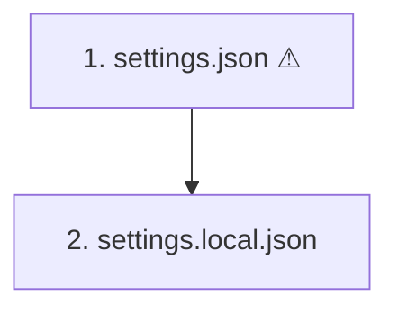

# Session Handoff — `:::explorer` directive
**Date:** 2026-08-13 · **Project:** blueprint-markdown-chieu (enhanced-markdown-vscode) · **Branch:** (not checked)

> For the next AI session: read this file first to resume. It captures the
> requirements, decisions, rules, and current state of the work below.

## Requirements & Goals

Build a new `:::explorer` container directive. It renders a **master-detail view**: a mermaid
diagram pinned in place while its per-node detail sections scroll beside it, with two-way
selection sync.

**Why it exists.** The user is rewriting their global `~/.claude/CLAUDE.md` section 7
("Diagrams Over Prose") so Claude *always* writes mermaid into a markdown file instead of
printing it in the terminal (they can't render mermaid in a terminal, and were copy-pasting
it out by hand every time).

That surfaced a second problem, which is what `:::explorer` solves: a diagram is lossy. When
detail sections sit *below* the diagram, you scroll away from the picture to read a box's
meaning — so you lose track of which box you're reading, and you can't tell when a box is
hiding something. The user's words: *"I am worry that info might be missing… somehow to let
me know there is something else I need to read when reading a component in diagram."*

### Authoring syntax (agreed)

````markdown
:::explorer


### 1. settings.json — `settings.json:1`
Four blocks matter at boot…

### 2. settings.local.json — `settings.local.json:1`
Machine-local overlay…
:::
````

### Renderer contract (agreed)

| Concern | Rule |
|---|---|
| Layout | First `mermaid` fence inside the block pins; **everything after it** scrolls in the detail pane |
| Matching | Mermaid node id `N<k>` ↔ heading whose text starts `<k>.` |
| Click node | Scroll that section into the detail pane, highlight node + section |
| Scroll details | Topmost visible section highlights its node |
| No match | Section renders normally, node just isn't clickable — **fail-soft** |
| Narrow screen | Stack vertically, diagram sticky at top |
| Attributes | `{pin=left}` (default), `{pin=top}`, `{width=45%}` |

## Decisions & Rationale

- **Matching by leading heading number, not `{#id}` attributes.** The author is already
  numbering nodes and headings for human readability, so the mapping comes free. Explicit ids
  were rejected: a second bookkeeping channel that can silently rot out of sync.
- **One wrapper directive; contents stay plain markdown.** Rejected a structured
  `:::node{n=1 title="…" src="…"}` child form — too verbose to author, and it would put
  content inside attributes where markdown can't reach it.
- **Two-way sync over one-way.** A simpler "pinned, no sync" variant (just `position: sticky`
  + two columns) was on the table and rejected by the user. Click-to-jump *and*
  scroll-to-highlight is the point: it's what keeps the reader oriented.
- **Fail-soft on unmatched nodes/sections** — consistent with the existing blueprint parser
  behaviour, where a malformed directive degrades rather than errors.
- **Rejected alternatives for the readability problem:** accordion under the diagram (still
  vertical); per-section mini-diagrams (no renderer work, but duplicates diagram source and
  loses the global view).

## Rules & Constraints

- **Fail-soft is the house style.** The blueprint parser never errors — a bad directive
  renders as plain text. `:::explorer` must not break that: with no renderer support at all,
  the content must still be fully readable top-to-bottom.
- **Must survive `Export to HTML (single file)`** (`blueprintMarkdown.exportHtml`). The sync
  behaviour is client-side JS, so it has to be bundled into the export path, not depend on
  the VS Code webview host.
- **Must coexist with existing mermaid pan/zoom** (`src/core/mermaidPanZoom.ts`). Node clicks
  and drag-to-pan will fight each other — distinguish click from drag.
- **Ponytail mode is active in the user's environment** — laziest solution that works. Check
  for reusable pieces before writing new ones (see `toc.ts` note below).
- User is a hands-on owner of this repo: *"blueprint is built by myself, I could add more
  directives."* Propose, don't over-build.

## State, Files & Next Steps

**Current state:** design agreed, **no code written in this repo yet.**

**Key files (in this repo — none modified yet):**
- `src/core/directives/index.ts` — directive registry; `explorer` gets registered here
- `src/core/directives/layout.ts` — existing `columns`/`col`; closest analog for the split layout
- `src/core/parser.ts` — `:::name{attrs}` parsing, where `{pin=…}` / `{width=…}` get read
- `src/core/fence.ts` — mermaid fence handling; needs to expose the rendered SVG's node ids
- `src/core/mermaidPanZoom.ts` — **conflict risk**; existing mermaid interaction layer
- `src/core/toc.ts` — **check this first**; likely already has scroll-spy that the
  section→node sync can reuse instead of a new IntersectionObserver
- `src/core/hydrate.ts` / `src/core/previewRuntime.ts` — client-side hydration; where the
  click + scroll wiring belongs
- `src/export/exportHtml.ts` — single-file export must keep working
- `skills/blueprint-markdown/SKILL.md` — the authoring skill lives in this repo; add
  `explorer` to the component catalog and the silent-failure trap table once it ships
- `skills/blueprint-markdown/validate.mjs` — add `explorer` to known directive names

**Fixture / reference file (outside this repo):**
- `/home/chieule/.claude/diagrams/config-loading.md` — a real, working sample in the *current*
  (diagram-above-details) format. It documents `~/.claude` boot order with live `file:line`
  pointers. Being rewritten into `:::explorer` form to serve as the build fixture. Read it to
  see the intended content shape: numbered nodes, `⚠` + dashed border on simplified nodes,
  a "Simplified:" line in those sections, and a `Not shown` block listing omissions.

**Open questions:**
- How mermaid node ids survive rendering — does the current pipeline preserve `N1`/`N2` as
  addressable ids in the output SVG, or do they get rewritten? This determines whether
  matching happens pre-render (on source) or post-render (on SVG).
- Click vs drag disambiguation against `mermaidPanZoom.ts` — threshold-based, or disable pan
  inside `:::explorer`?
- Does `{pin=top}` sticky behaviour work inside the VS Code webview's scroll container, or
  does it need a JS fallback?
- Highlight styling not specified — needs to work in both light and dark preview themes.

**Next steps:**
1. Read `src/core/toc.ts` and `src/core/mermaidPanZoom.ts` before writing anything — confirm
   what scroll-spy and mermaid-node access already exist.
2. Answer the node-id question above by rendering a test mermaid block and inspecting the SVG.
3. Register `explorer` in `src/core/directives/index.ts` with layout only (pinned split, no
   sync) — verify it renders and degrades cleanly.
4. Add click→scroll, then scroll→highlight.
5. Verify `Export to HTML (single file)` still works with sync intact.
6. Update `skills/blueprint-markdown/SKILL.md` + `validate.mjs`, bump version, package `.vsix`.

**Work happening in parallel (other session, not this repo):** rewrite of
`~/.claude/CLAUDE.md` section 7 to mandate the file-output + `:::explorer` format, and the
rewrite of `diagrams/config-loading.md` into that format.
