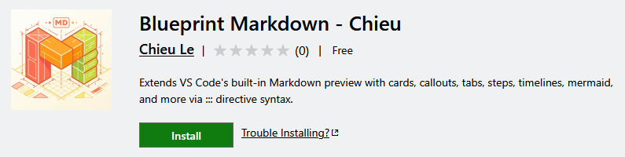
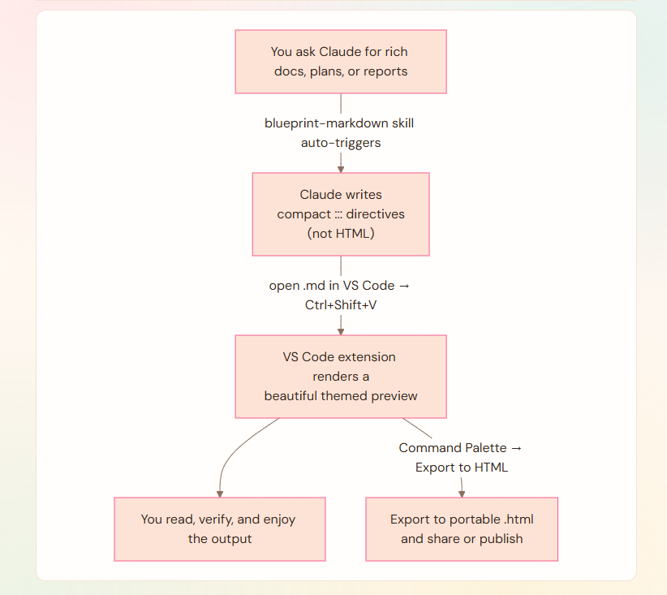

# Blueprint Markdown

> Stop generating heavy HTML artifacts. Let AI write compact `:::` directives — then read and verify the output in a beautiful themed preview.

[](https://marketplace.visualstudio.com/items?itemName=ChieuLe.blueprint-markdown-chieu)
[](https://marketplace.visualstudio.com/items?itemName=ChieuLe.blueprint-markdown-chieu)
[](https://marketplace.visualstudio.com/items?itemName=ChieuLe.blueprint-markdown-chieu)
[](LICENSE)


---

## Why Blueprint Markdown?

When you ask an AI to produce rich documentation, reports, or plans, the usual answer is
an **HTML artifact** — a self-contained blob of HTML, CSS, and JavaScript.

That works, but it has real costs:

| | HTML artifact | Blueprint Markdown |
|---|---|---|
| **Output size** | Large — full HTML/CSS/JS boilerplate every time | Small — just plain `:::` markdown directives |
| **Token cost** | High — generates and returns thousands of extra tokens | Low — directives are a fraction of equivalent HTML |
| **Generation speed** | Slow — model writes verbose markup | Fast — compact syntax, less to produce |
| **Reading / verifying** | Hard — raw HTML obscures the actual content | Easy — directives read like plain text |
| **Theming** | Static, embedded styles | 10 live themes; switch instantly |

Blueprint Markdown is two complementary pieces:

- **The Skill** — a Claude Code skill that teaches Claude to write `:::` directives instead of HTML artifacts. Auto-triggers on rich-markdown requests.
- **The Extension** — a VS Code Markdown preview renderer that turns those directives into beautiful, themed output.

---

## How It Works


<!-- ```
flowchart TD
    A["You ask Claude for rich docs, plans, or reports"]
    B["Claude writes\ncompact ::: directives\n(not HTML)"]
    C["VS Code extension renders a\nbeautiful themed preview"]
    D["You read, verify, and enjoy the output"]
    E["Export to portable .html\nand share or publish"]

    A -- >|"blueprint-markdown skill auto-triggers"| B
    B -- >|"open .md in VS Code → Ctrl+Shift+V"| C
    C -- > D
    C -- >|"Command Palette → Export to HTML"| E
``` -->

No extra commands. No HTML to wade through. The directives are human-readable
even in the raw `.md` file.

---

## Quickstart

Five steps from zero to a beautiful themed preview:

1. **Install the skill** — paste this into your AI agent (Claude Code, Cursor, Copilot, etc.):

   ```
   Set up the blueprint-markdown skill from
   https://github.com/lebinhchieu/blueprint-markdown/tree/master/skills/blueprint-markdown
   ```

   The agent fetches and installs it. Reload the session afterward. ([details](#1-the-skill--ai-agent-integration))

2. **Install the extension** from the VS Code Marketplace:

   ```bash
   code --install-extension ChieuLe.blueprint-markdown-chieu
   ```

   ([details](#2-the-extension--preview-renderer))

3. **Disable the conflicting built-in** — Extensions (`Ctrl+Shift+X`) → search `@builtin mermaid` → **Markdown Mermaid features** → **Disable** → Reload Window. ([why](#known-conflict--vscodemermaid-markdown-features))

4. **Ask your AI to write with Blueprint Markdown** — e.g. *"Write the release notes using the blueprint-markdown skill."* The skill emits `:::` directives instead of HTML.

5. **Preview & pick a theme** — open the `.md` file → `Ctrl+Shift+V`, then `Ctrl+,` → search `blueprintMarkdown` to choose from [10 themes](#3-beautiful-themes). Enjoy.

---

## 1. The Skill — AI Agent Integration

The `blueprint-markdown` skill lives in `skills/blueprint-markdown/`. It teaches
your AI coding agent to **author** the directive syntax automatically.

**What it does:**
- Writes `:::cards`, `:::callout`, `:::steps`, `:::timeline` and other directives instead of HTML.
- Auto-triggers whenever you ask for rich docs, release notes, reports, or status pages — no slash command needed.
- Auto-formats **Claude Code plan-mode files** (`~/.claude/plans/*.md`) with rich directives so they render beautifully in the extension.
- Falls back to plain CommonMark for non-Blueprint contexts (GitHub, Slack, Notion).
- Loads the full attribute reference (`references/syntax.md`) on demand for precise output.

### Install the skill

**Quick setup — paste this into your AI coding agent** (Claude Code, Cursor, Copilot, Codex, Gemini, etc.):

```
Set up the blueprint-markdown skill from
https://github.com/lebinhchieu/blueprint-markdown/tree/master/skills/blueprint-markdown
```

The agent will fetch the skill and install it in the right place for itself. Reload the session afterward.

**Manual install — if you already cloned this repo:**

**Global — available in every project:**

```bash
# From the repo root (symlink, no duplication):
ln -s "$PWD/skills/blueprint-markdown" ~/.claude/skills/blueprint-markdown

# Or copy if you prefer no symlink:
cp -r skills/blueprint-markdown ~/.claude/skills/
```

**Project-scoped — this repo only:**

```bash
mkdir -p .claude/skills
cp -r skills/blueprint-markdown .claude/skills/
```

Restart Claude Code (or reload the session) after placing the skill. It will be
picked up automatically from the `skills/` directory.

### Install via Claude Code plugin marketplace

This repo is also a Claude Code plugin marketplace bundling both skills
(`blueprint-markdown` and `mermaid-diagrams`) — no cloning required:

```
/plugin marketplace add lebinhchieu/blueprint-markdown
/plugin install blueprint-markdown-skills@blueprint-markdown-skills-marketplace
```

**Enable auto-update** so new releases show up without re-running commands:

- `/plugin` → **Marketplaces** tab → select `blueprint-markdown-skills-marketplace` from the list to open its detail view → **Enable auto-update**.
- Claude Code then checks for updates after each session start (up to a 10-minute delay) and updates the plugin on disk automatically. You'll see a prompt to run `/reload-plugins` once it does.
- No CLI flag for this — it's only in the interactive `/plugin` panel, not `claude plugin marketplace update`.

Without auto-update, upgrade manually:

```
/plugin marketplace update lebinhchieu/blueprint-markdown
/plugin update blueprint-markdown-skills@blueprint-markdown-skills-marketplace
```

### Skill files

| File | Purpose |
|------|---------|
| `SKILL.md` | Skill definition — name, description, grammar rules, authoring principles |
| `references/syntax.md` | Full per-directive attribute reference (loaded on demand) |
| `assets/sample.md` | Demo fixture exercising every directive — useful as a test file |

---

## 2. The Extension — Preview Renderer

The VS Code extension renders the `:::` directives produced by the skill.
It hooks VS Code's **built-in Markdown preview** — no new panels, no extra commands.

### Install

**VS Code Marketplace *(recommended)*:**

```bash
code --install-extension ChieuLe.blueprint-markdown-chieu
```

Or: **Extensions** (`Ctrl+Shift+X`) → search **Blueprint Markdown** → Install.

**From VSIX:**

```bash
code --install-extension blueprint-markdown-chieu-0.1.6.vsix
```

Download from [Releases](https://github.com/lebinhchieu/blueprint-markdown/releases),
or via the Extensions panel: **⋯ → Install from VSIX…**

**Build from source:**

```bash
git clone https://github.com/lebinhchieu/blueprint-markdown.git
cd blueprint-markdown
npm install && npm run build
# Press F5 to launch the Extension Development Host
```

### Known conflict — `vscode.mermaid-markdown-features`

VS Code ships a built-in extension called **Markdown Mermaid features** (`vscode.mermaid-markdown-features`) that also renders Mermaid diagrams in the Markdown preview. When both extensions are active they collide, and Mermaid diagrams will not render correctly.

> [!WARNING]
>**Fix:** Disable the built-in extension:
>Extensions (`Ctrl+Shift+X`) → search **`@builtin mermaid`** → **Markdown Mermaid features** → **Disable** → Reload Window.

### Open the preview

Open any `.md` file → **`Ctrl+Shift+V`** (Markdown: Open Preview to the Side).

Quick test:


```markdown
:::tip
Blueprint Markdown is working!
:::
```

---

## 3. Export to HTML

**Command:** `Blueprint Markdown: Export to HTML` (Command Palette `Ctrl+Shift+P`)

Converts the active `.md` file into a portable `.html` file that anyone can open in a browser — no extension required.

- All CSS is inlined; fonts, icons, Mermaid diagrams, and mindmaps load from CDN.
- The exported file uses the same theme you have active in the preview.
- Mermaid / mindmap CDN scripts are injected only when the document actually uses them.

> **Note:** Layout, components, and code highlighting work offline. Fonts, icons, Mermaid diagrams, and mindmaps require an internet connection.

---

## 4. Beautiful Themes

Reviewing AI output shouldn't feel like reading a wall of text. Choose a theme that
suits your mood — switch any time, preview refreshes instantly.

| Setting value | Name | Vibe |
|--------------|------|------|
| `light` *(default)* | Warm Artisan Light | Terracotta on warm parchment — editorial feel |
| `dark` | Warm Artisan Dark | Bright terracotta on near-black |
| `auto` | Auto | Follows VS Code's active light/dark theme |
| `neon-synthwave` | Neon Synthwave | Cyan + magenta on blue-black |
| `neon-cyberpunk` | Neon Cyberpunk | Electric green on black |
| `neon-vaporwave` | Neon Vaporwave | Purple + pink on violet-black |
| `aurora` | Aurora | Iridescent orchid pastels on pearl white |
| `jewel-garden` | Jewel Garden | Rich amethyst & emerald on ivory |
| `tropical-sorbet` | Tropical Sorbet | Bright coral & citrus on cream |
| `tropical-sorbet-night` | Tropical Sorbet Night | Coral & citrus candy on warm cocoa dark |

**How to change:**

- **Settings UI**: `Ctrl+,` → search `blueprintMarkdown` → pick from dropdown.
- **settings.json**:

  ```json
  "blueprintMarkdown.theme": "aurora"
  ```

<!-- SCREENSHOT: theme grid showing all 10 palettes side by side.
     Save as media/screenshots/theme-grid.png, then uncomment:

-->

---

## 4. Syntax Quick Reference

Three directive forms — colon count is the grammar.

### Container `:::` (open + close)

Used by all block components.

```markdown
:::warning{title="Watch out"}
This action cannot be undone.
:::

:::cards{cols=3}
:::card{title="Speed" icon=bolt}
Compact directives generate fast.
:::
:::card{title="Size" icon=compress}
No HTML boilerplate.
:::
:::card{title="Themes" icon=palette}
10 palettes, one setting.
:::
:::
```

### Leaf `::` (single line)

Used **only** by `progress`.

```markdown
::progress{value=80 max=100 color=primary label="Completion"}
```

### Inline `:` (within paragraphs)

```markdown
Status: :chip[Stable]{success}  Shortcut: :kbd[Ctrl+Shift+V]  Priority: :rating{value=5 max=5}
```

### Component families

| Family | Directives |
|--------|-----------|
| Cards | `:::card` `:::cards` |
| Callouts | `:::callout` `:::note` `:::tip` `:::info` `:::warning` `:::danger` `:::success` |
| Collapse | `:::details` `:::accordion` |
| Layout | `:::columns` `:::col` |
| Timeline | `:::timeline` `:::event` |
| Navigation | `:::tabs` `:::tab` |
| Steps | `:::steps` `:::step` |
| Progress | `::progress` |
| Mindmap | `:::mindmap` — headings become an interactive node graph |
| Inline | `:chip` `:icon` `:color` `:kbd` `:button` `:tooltip` `:rating` |

### Color tokens

`primary` · `success` (`green`) · `warning` (`amber`) · `danger` (`red`) · `info` (`blue`) · `gray` · `low` (`yellow`) · `purple` · `teal` · `pink` · `cyan` · raw hex (e.g. `#0a7`)

### Fails silently — common mistakes

- ❌ Space after colons: `::: info` — use `:::info`
- ❌ More than one `{…}` block per directive line
- ❌ Multi-word values without quotes: `title=Two words` — use `title="Two words"`
- ❌ `:::progress` — use `::progress` (leaf, not container)
- ❌ `:::column` — use `:::col`
- ❌ Unclosed container — consumes rest of the document

> Full reference: [`skills/blueprint-markdown/references/syntax.md`](skills/blueprint-markdown/references/syntax.md)

---

## Contributing

Bug reports and feature requests → [GitHub Issues](https://github.com/lebinhchieu/blueprint-markdown/issues).
Pull requests welcome — open an issue first for significant changes.

```bash
npm run watch   # esbuild watch mode — rebuilds on every change
# F5 in VS Code → Extension Development Host
# "Reload Window" in dev host → picks up the latest build
```

---

## License

MIT © [Chieu Le](https://github.com/lebinhchieu) — see [LICENSE](LICENSE).
