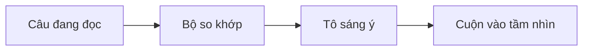

# Chế độ Present giờ theo sát lời đọc, từng ý một

## Kiểu làm mờ cũ che mất ngữ cảnh :cue{#hook}

:::warning{title="Trước khi thiết kế lại" #old}
Mọi thứ ngoài vùng chiếu sáng đều bị làm mờ. Trong một danh sách dài, không có gì cho biết giọng đọc đang nói tới mục nào.
:::

## Hai lớp tô sáng: phần đang nói, và ý đang đọc :cue{#answer}

:::cards{cols=2 #two}
:::card{title="Viền phần" icon=crop_free}
Khối được gọi tên có một đường viền. Phần còn lại của trang vẫn rõ nét.
:::
:::card{title="Tô sáng ý" icon=my_location}
Bên trong viền, một thanh màu đánh dấu mục mà người đọc đang nhắc tới.
:::
:::

## Ý đang đọc được tìm theo ba cách :cue{#how}

:::steps{#ways}
:::step{title="Từ chỉ thứ tự"}
Câu mở đầu bằng *Thứ nhất*, *Thứ hai* hay *Cuối cùng* sẽ tô mục theo đúng thứ tự.
:::
:::step{title="Từ ngữ trùng nhau"}
Từ ngữ mà câu chỉ chung với một mục sẽ chọn mục đó. Nếu hòa thì không tô gì.
:::
:::step{title="Ghim trực tiếp"}
Dấu `:at` đặt trước một câu sẽ ghim mục, và giữ nguyên đến dấu ghim tiếp theo.
:::
:::

## Khối nào cũng có ý để chỉ :cue{#kinds}

| Khối | Các ý của nó :cue{#types table} |
|---|---|
| Danh sách | từng mục trong danh sách |
| Bảng | từng hàng dữ liệu |
| Các bước và dòng thời gian | từng bước, từng sự kiện |
| Lưới thẻ | từng thẻ |
| Sơ đồ mermaid | từng nút |

## Sơ đồ sáng lên theo từng nút :cue{#flow-h}



## Mã nguồn đi qua từng dòng :cue{#code-h}

```md #snippet title="bai-noi.md"
:::say{on="snippet"}
Thư mục lấy theo tên tài liệu.
:at{lines="3"} Giọng đọc thành một slug.
:at{lines="4"} Mã băm đặt tên cho tệp.
:::
```

## Thanh điều khiển: mỗi chức năng một phím :cue{#dock-h}

| Phím | Tác dụng :cue{#keys table} |
|---|---|
| Space | Phát hoặc tạm dừng, rồi phát tiếp ngay giữa câu :cue{#k-space} |
| R | Phát lại phần hiện tại từ đầu :cue{#k-r} |
| Mũi tên trái và phải | Phần trước hoặc phần sau :cue{#k-arrows} |
| Shift cùng mũi tên | Câu trước hoặc câu sau :cue{#k-shift} |
| C | Bật hoặc tắt phụ đề :cue{#k-c} |
| Dấu trừ và dấu cộng | Chậm hơn hoặc nhanh hơn, có lưu lại :cue{#k-speed} |

Thanh tiến trình phía trên các nút có một vạch cho mỗi phần, dài theo lời đọc. Rê chuột lên vạch để xem ghi chú; bấm để nhảy tới. :cue{#track}

## Những gì chưa được kiểm chứng :cue{#risks-h}

:::info{title="Rủi ro còn mở" #risks}
- So khớp từ ngữ có thể chọn sai khi hai mục dùng chung từ.
- Bản xem trước trong VS Code chưa được thử từ bản cài đặt thật.
- Mới chỉ kiểm tra bằng mắt giao diện sáng.
:::

## Thử ngay trên trang này :cue{#next}

Bấm **Present**, rồi bấm vào mục đang được tô để nghe lại câu của nó.

:::narration{lang="vi"}
:::say{on="hook old" note="Làm mờ che mất ngữ cảnh"}
Trước đây, chế độ Present làm mờ mọi thứ ngoài vùng chiếu sáng. Cách đó che mất ngữ cảnh xung quanh. Và trong một danh sách dài, không có gì cho biết giọng đọc đang ở mục nào.
:::
:::say{on="two" note="Viền phần, cộng tô sáng ý"}
Giờ đây, mọi thứ chia làm hai lớp. Viền phần đánh dấu khối đang nói, và trang vẫn rõ nét. Tô sáng ý đánh dấu mục mà người đọc đang nhắc tới.
:::
:::say{on="ways" note="Thứ tự, từ trùng, hoặc ghim"}
Ý đang đọc được tìm theo ba cách. Thứ nhất, từ chỉ thứ tự chọn mục theo đúng thứ tự, như chính câu này. Thứ hai, từ ngữ trùng nhau chọn đúng một mục mà câu nói tới. Cuối cùng, một dấu ghim trong kịch bản sẽ ghi đè cả hai cách trên.
:::
:::say{on="types" note="Danh sách, hàng, bước, thẻ, nút"}
Gần như khối nào cũng có ý để chỉ. Một danh sách có các mục của nó. Một bảng có các hàng dữ liệu. Dòng thời gian cũng vậy, với từng sự kiện. Một lưới thẻ có từng thẻ. Ngay cả sơ đồ mermaid cũng có ý, đó là các nút.
:::
:::say{on="flow" note="Nút sáng lên khi được nhắc"}
Đây là quy trình phía sau. Mỗi câu đang đọc được lấy ra lần lượt. Bộ so khớp đem nó so với từng mục. Mục thắng được tô thành điểm sáng. Sau đó trang cuộn nó vào tầm nhìn, chỉ khi nó nằm ngoài màn hình.
:::
:::say{on="snippet" lines="1-5" note="Ghim đi qua từng dòng mã"}
Mã nguồn cũng được đối xử như vậy. :at{lines="2"} Trong kịch bản, câu đầu tiên chỉ là lời đọc bình thường. :at{lines="3"} Một dấu ghim có số dòng sẽ chuyển điểm sáng tới dòng đó. :at{lines="4"} Dấu ghim tiếp theo lại chuyển nó đi, trong khi cả khối vẫn được viền.
:::
:::say{on="keys" note="Mỗi chức năng một phím"}
Thanh điều khiển giờ là một khung nổi. :at{#k-space} Phím Space để phát và tạm dừng, và giờ tạm dừng sẽ phát tiếp ngay giữa câu. :at{#k-r} Phím R phát lại phần hiện tại từ câu đầu tiên. :at{#k-shift} Shift cùng phím mũi tên sẽ đi từng câu một. :at{#k-speed} Tốc độ đọc được lưu lại. :at{#track} Và thanh tiến trình cho thấy mọi phần, dài ngắn theo thời lượng.
:::
:::say{on="risks" note="⚠ So khớp có thể đoán sai"}
Có ba điều chưa được kiểm chứng. Thứ nhất, so khớp từ ngữ có thể chọn sai khi hai mục dùng chung từ. Thứ hai, bản xem trước thật trong VS Code chưa được thử từ bản cài đặt. Thứ ba, mới chỉ có giao diện sáng được kiểm tra bằng mắt.
:::
:::say{on="next" note="Bấm vào mục để nghe lại"}
Vậy bước tiếp theo rất đơn giản. Hãy bấm Present trên trang này, rồi bấm vào mục đang được tô để nghe lại câu của nó.
:::
:::
