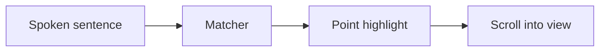

# Present mode now follows the narration point by point

## The old spotlight hid the context :cue{#hook}

:::warning{title="Before the redesign" #old}
Everything outside the spotlight faded out. Inside a long list, nothing showed which item the voice was on.
:::

## Two highlights: the section, and the point being read :cue{#answer}

:::cards{cols=2 #two}
:::card{title="Section ring" icon=crop_free}
The cued block gets a ring. The rest of the page stays at full strength.
:::
:::card{title="Point highlight" icon=my_location}
Inside the ring, a filled bar marks the item the narrator is talking about now.
:::
:::

## The point is found three ways :cue{#how}

:::steps{#ways}
:::step{title="Ordinal signposts"}
A sentence that opens with *First*, *Second* or *Finally* lights that item in order.
:::
:::step{title="Shared words"}
Words the sentence shares with only one item pick that item. Ties light nothing.
:::
:::step{title="Explicit pin"}
An `:at` marker before a sentence pins the item, and holds until the next marker.
:::
:::

## Any structure has points :cue{#kinds}

| Block | Its points :cue{#types table} |
|---|---|
| List | each list item |
| Table | each body row |
| Steps and timeline | each step, each event |
| Card grid | each card |
| Mermaid diagram | each node |

## Diagrams light node by node :cue{#flow-h}



## Code steps through line by line :cue{#code-h}

```md #snippet title="talk.md"
:::say{on="snippet"}
The folder comes from the document.
:at{lines="3"} The voice becomes a slug.
:at{lines="4"} The hash names the file.
:::
```

## The dock puts every control under one key :cue{#dock-h}

| Key | Does :cue{#keys table} |
|---|---|
| Space | Play or pause, and resume mid-sentence :cue{#k-space} |
| R | Restart the current segment :cue{#k-r} |
| Left and right arrows | Previous or next segment :cue{#k-arrows} |
| Shift with an arrow | Previous or next sentence :cue{#k-shift} |
| C | Captions on or off :cue{#k-c} |
| Minus and plus | Slower or faster, remembered :cue{#k-speed} |

The track above the buttons has one mark per segment, as wide as its narration. Hover a mark for its note; click it to jump. :cue{#track}

## What is not proven yet :cue{#risks-h}

:::info{title="Open risks" #risks}
- Word matching can pick the wrong item when two items share their words.
- The VS Code preview itself has not been tested from an installed build.
- Only the light theme was checked by eye.
:::

## Try it on this page :cue{#next}

Press **Present**, then click any highlighted item to hear its sentence again.

:::narration
:::say{on="hook old" note="Fading hid the context"}
Present mode used to fade out everything but the spotlight. That hid the context around it. And inside a long list, nothing showed which item the voice was on.
:::
:::say{on="two" note="Section ring plus point highlight"}
Now it works in two layers. The section ring marks the block, and the page stays at full strength. The point highlight marks the item the narrator is talking about right now.
:::
:::say{on="ways" note="Ordinals, shared words, or a pin"}
The point is found in three ways. First, ordinal signposts pick items in order, just like this sentence. Second, shared words pick the one item a sentence talks about. Finally, an explicit pin in the script overrides both.
:::
:::say{on="types" note="Lists, rows, steps, cards, nodes"}
Almost any block has points. A list has its items. A table has its body rows. Timeline events work the same way. A card grid has its cards. Even a mermaid diagram has points: its nodes.
:::
:::say{on="flow" note="Nodes light as they are named"}
Here is the pipeline behind it. Each spoken sentence is taken in turn. The matcher compares it with every item. The winner gets the point highlight. Then the page scrolls it into view, only when it is off screen.
:::
:::say{on="snippet" lines="1-5" note="Pins step through code lines"}
Code gets the same treatment. :at{lines="2"} In the script, the first sentence is plain narration. :at{lines="3"} A pin with a line number moves the highlight to that line. :at{lines="4"} The next pin moves it again, while the whole block stays ringed.
:::
:::say{on="keys" note="One key per control"}
The play bar is now a floating dock. :at{#k-space} Space plays and pauses, and pause now resumes mid-sentence. :at{#k-r} The R key restarts the current segment from its first sentence. :at{#k-shift} Shift with an arrow steps one sentence at a time. :at{#k-speed} Speed changes are remembered. :at{#track} And the track shows every segment, sized by how long it runs.
:::
:::say{on="risks" note="⚠ Matching can guess wrong"}
Three things are not proven yet. First, word matching can pick the wrong item when two items share their words. Second, the real VS Code preview has not been tested from an installed build. Third, only the light theme was checked by eye.
:::
:::say{on="next" note="Click an item to replay it"}
So the next step is simple. Press Present on this page, and click any highlighted item to hear its sentence again.
:::
:::
