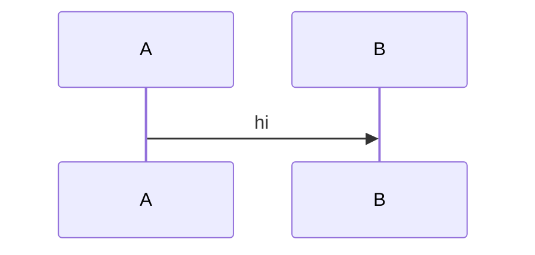
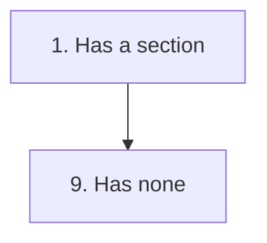
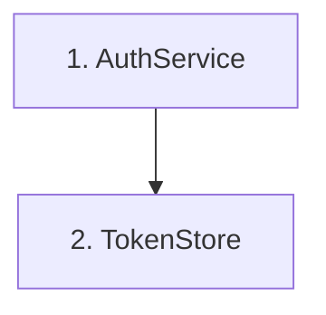

# `:::explorer` Directive Implementation Plan

> **For agentic workers:** REQUIRED SUB-SKILL: Use superpowers:subagent-driven-development (recommended) or superpowers:executing-plans to implement this plan task-by-task. Steps use checkbox (`- [ ]`) syntax for tracking.

**Goal:** Add a `:::explorer` container directive that pins a mermaid diagram beside its scrolling per-node detail sections, with two-way click/scroll selection sync.

**Architecture:** A server-side directive splits the container's children at the first mermaid fence into a pin pane and a detail pane. All matching is client-side: `explorerSync.ts` pairs `g.node` elements whose id ends `flowchart-N<k>-<n>` against detail headings whose text starts `<k>.`, then wires click-to-jump and scroll-to-highlight. Layout is CSS grid with a `position: sticky` pin column — no nested scroll container.

**Tech Stack:** TypeScript, markdown-it, mermaid 11.15, esbuild. No new dependencies.

**Spec:** `docs/superpowers/specs/2026-08-13-explorer-directive-design.md`

## Global Constraints

- **No new dependencies.** No CDN script, no `.vscodeignore` change (`media/**` is already allowlisted).
- **Fail-soft is the house style.** The parser never errors; a malformed directive degrades. With no renderer support at all the content must still read top-to-bottom.
- **Mermaid node ids carry a per-render prefix.** Real id is `mermaid-1786602232448-flowchart-N1-0`. `[id^="flowchart-N1-"]` matches **nothing**. Always match with `/flowchart-N(\d+)-\d+$/`.
- **`classDef` writes `!important` inline on the node `<rect>`.** No CSS can change a node's `fill`, `stroke`, or `stroke-width`. Only style the `<g>` (which has no inline style) or append new child elements.
- **Pan is right-drag only** (`mermaidPanZoom.ts:176` bails on `e.button !== 2`). Left-click is unclaimed — do not add a click/drag threshold.
- **Scroll sync depends on `token.map` reaching the `data-line` wrapper** (`markdownItPlugin.ts:221-228`). Never re-wrap or short-circuit `em_directive` output.
- **There is no test framework in this repo.** Pure logic gets a runnable `node` self-check using the existing esbuild-transpile pattern (`esbuild.mjs:280-293`). DOM behaviour is verified with `playwright-cli` against exported HTML.
- **Target version:** bump `package.json` from `1.1.8` to `1.2.0`.

---

## File Structure

| File | Responsibility |
|---|---|
| `src/core/directives/explorer.ts` | **Create.** Pure `splitAtMermaidFence()` + the directive's `render()`. |
| `scripts/check-explorer.mjs` | **Create.** Runnable assert self-check for the split logic. |
| `src/core/explorerSync.ts` | **Create.** Client-side pairing, click-to-jump, scroll-spy. |
| `media/components.css` | **Modify.** Append the `.em-explorer` block. |
| `src/core/directives/index.ts` | **Modify.** Register `explorerDirectives`. |
| `src/core/previewRuntime.ts` | **Modify.** Chain `setupExplorers` after `renderMermaid`. |
| `skills/blueprint-markdown/validate.mjs` | **Modify.** Add `explorer` to `REGISTRY`. |
| `skills/blueprint-markdown/SKILL.md` | **Modify.** Catalog entry + trap-table row. |
| `package.json` | **Modify.** Version bump. |

---

### Task 1: Pure fence-split logic

**Files:**
- Create: `src/core/directives/explorer.ts`
- Create: `scripts/check-explorer.mjs`

**Interfaces:**
- Consumes: `ASTNode`, `TextNode` from `src/core/types.ts`
- Produces: `export function splitAtMermaidFence(children: ASTNode[] | undefined): { pin: ASTNode[]; detail: ASTNode[] }`

**Why a split function and not `ctx.renderChildren` twice:** `RenderCtx` only exposes `renderChildren(node)`, which renders *all* children. Task 2 renders each half by passing a synthetic node — `ctx.renderChildren({ ...node, children: pin })` — so `renderer.ts` and `types.ts` need no changes at all.

- [ ] **Step 1: Write the self-check (it will fail — the module does not exist yet)**

Create `scripts/check-explorer.mjs`:

```js
/**
 * check-explorer.mjs — runnable assert check for splitAtMermaidFence.
 *
 * No test framework in this repo. Transpiles the TS module to a throwaway
 * CJS file and requires it, mirroring esbuild.mjs:280-293.
 *
 * Run: node scripts/check-explorer.mjs
 */
import assert from 'node:assert/strict'
import fs from 'node:fs'
import path from 'node:path'
import { createRequire } from 'node:module'
import * as esbuild from 'esbuild'

if (!fs.existsSync('dist')) fs.mkdirSync('dist', { recursive: true })
const tmpFile = path.resolve('dist', '.tmp-explorer.cjs')
await esbuild.build({
  entryPoints: ['src/core/directives/explorer.ts'],
  bundle: true,
  platform: 'node',
  format: 'cjs',
  outfile: tmpFile,
  logLevel: 'silent',
})
const { splitAtMermaidFence } = createRequire(import.meta.url)(tmpFile)
try { fs.unlinkSync(tmpFile) } catch {}

const text = (...lines) => ({ type: 'text', lines })
const warn = { type: 'directive', form: 'container', name: 'warning', attrs: {}, children: [] }

// 1. Basic split: fence pins, headings scroll.
{
  const { pin, detail } = splitAtMermaidFence([
    text('', '```mermaid', 'graph TD', '  N1["1. A"]', '```', '', '### 1. A', 'Body.'),
  ])
  assert.deepEqual(pin, [text('', '```mermaid', 'graph TD', '  N1["1. A"]', '```')])
  assert.deepEqual(detail, [text('', '### 1. A', 'Body.')])
}

// 2. A sibling directive after the text node lands in the detail pane.
//    This is the ":::warning{title='Not shown'}" case — it must not be lost.
{
  const { pin, detail } = splitAtMermaidFence([
    text('```mermaid', 'graph TD', '```', '### 1. A'),
    warn,
  ])
  assert.deepEqual(pin, [text('```mermaid', 'graph TD', '```')])
  assert.equal(detail.length, 2)
  assert.deepEqual(detail[0], text('### 1. A'))
  assert.equal(detail[1], warn)
}

// 3. Lines before the fence stay in the pin pane (intro text above the diagram).
{
  const { pin, detail } = splitAtMermaidFence([
    text('Intro line.', '', '```mermaid', 'graph TD', '```', '### 1. A'),
  ])
  assert.deepEqual(pin, [text('Intro line.', '', '```mermaid', 'graph TD', '```')])
  assert.deepEqual(detail, [text('### 1. A')])
}

// 4. No mermaid fence: pin is empty, everything renders as detail.
{
  const { pin, detail } = splitAtMermaidFence([text('Just prose.', '### 1. A')])
  assert.deepEqual(pin, [])
  assert.deepEqual(detail, [text('Just prose.', '### 1. A')])
}

// 5. A ```mermaid inside a ````markdown example is NOT the pin — the outer
//    fence is skipped whole. (This document itself contains that shape.)
{
  const { pin, detail } = splitAtMermaidFence([
    text('````markdown', ':::explorer', '```mermaid', 'graph TD', '```', ':::', '````', '### 1. A'),
  ])
  assert.deepEqual(pin, [])
  assert.equal(detail.length, 1)
}

// 6. Unclosed mermaid fence: pin takes everything, detail is empty.
{
  const { pin, detail } = splitAtMermaidFence([text('```mermaid', 'graph TD')])
  assert.deepEqual(pin, [text('```mermaid', 'graph TD')])
  assert.deepEqual(detail, [])
}

// 7. Undefined children (leaf-shaped node) does not throw.
{
  const { pin, detail } = splitAtMermaidFence(undefined)
  assert.deepEqual(pin, [])
  assert.deepEqual(detail, [])
}

console.log('✓ splitAtMermaidFence: 7 checks passed')
```

- [ ] **Step 2: Run it to verify it fails**

Run: `node scripts/check-explorer.mjs`
Expected: FAIL — esbuild cannot resolve `src/core/directives/explorer.ts`.

- [ ] **Step 3: Write the implementation**

Create `src/core/directives/explorer.ts` with **only** the split logic for now (the `render` half is Task 2):

```ts
/**
 * explorer.ts — :::explorer directive.
 *
 * Renders a master-detail view: the first mermaid fence pins in place while
 * the per-node detail sections scroll beside it. Node↔section pairing is done
 * entirely client-side by src/core/explorerSync.ts — both halves of the pair
 * already exist in the DOM, so there is nothing to keep in sync across the
 * server/browser boundary.
 *
 * :::explorer
 * ```mermaid
 * graph TD
 *   N1["1. AuthService"] --> N2["2. TokenStore"]
 * ```
 *
 * ### 1. AuthService — `src/auth/service.ts:44`
 * Validates creds, issues JWT.
 * :::
 */

import type { ASTNode } from '../types'

const RE_FENCE = /^(\s*)(`{3,}|~{3,})/

export interface ExplorerSplit {
  /** Lines up to and including the first mermaid fence's closing line. */
  pin: ASTNode[]
  /** Everything after it: the rest of that text node plus all later siblings. */
  detail: ASTNode[]
}

/**
 * Split a container's children at the first mermaid fence.
 *
 * Fenced blocks live inside a single TextNode (parser.ts pushes fence lines
 * straight into the current text run), so the split happens *within* one
 * node's lines — but any sibling nodes after it, such as a nested
 * :::warning, belong to the detail pane and must be carried across.
 *
 * Fail-soft: with no mermaid fence, `pin` is empty and everything renders as
 * detail, which reads exactly like plain markdown.
 */
export function splitAtMermaidFence(children: ASTNode[] | undefined): ExplorerSplit {
  if (!children) return { pin: [], detail: [] }

  for (let i = 0; i < children.length; i++) {
    const child = children[i]
    if (child.type !== 'text') continue

    const end = mermaidFenceEnd(child.lines)
    if (end === -1) continue

    const tail = child.lines.slice(end + 1)
    const detail: ASTNode[] = []
    if (tail.length > 0) detail.push({ type: 'text', lines: tail })
    detail.push(...children.slice(i + 1))

    return { pin: [{ type: 'text', lines: child.lines.slice(0, end + 1) }], detail }
  }

  return { pin: [], detail: children }
}

/** Index of the closing line of the first *mermaid* fence, or -1 if there is none. */
function mermaidFenceEnd(lines: string[]): number {
  for (let i = 0; i < lines.length; i++) {
    const m = lines[i].match(RE_FENCE)
    if (!m) continue
    const marker = m[2]
    const info = lines[i].slice(m[0].length).trim().toLowerCase()
    if (info.startsWith('mermaid')) return closeIndex(lines, i, marker)
    // A different fence opened first — skip it whole, so a ```mermaid nested
    // inside a ````markdown example is never mistaken for the real diagram.
    i = closeIndex(lines, i, marker)
  }
  return -1
}

/** Index of the line closing the fence opened at `open`; last line if unclosed. */
function closeIndex(lines: string[], open: number, marker: string): number {
  for (let i = open + 1; i < lines.length; i++) {
    const m = lines[i].match(RE_FENCE)
    if (m && m[2][0] === marker[0] && m[2].length >= marker.length) return i
  }
  return lines.length - 1
}
```

- [ ] **Step 4: Run the check to verify it passes**

Run: `node scripts/check-explorer.mjs`
Expected: `✓ splitAtMermaidFence: 7 checks passed`

- [ ] **Step 5: Commit**

```bash
git add src/core/directives/explorer.ts scripts/check-explorer.mjs
git commit -m "feat(explorer): split container children at the first mermaid fence"
```

---

### Task 2: Directive render + layout (no sync yet)

**Files:**
- Modify: `src/core/directives/explorer.ts` (append the `DirectiveSpec`)
- Modify: `src/core/directives/index.ts:22` and `:39`
- Modify: `media/components.css` (append at end of file)

**Interfaces:**
- Consumes: `splitAtMermaidFence` from Task 1; `DirectiveSpec`, `RenderCtx` from `src/core/types.ts`
- Produces: `export const explorerDirectives: Record<string, DirectiveSpec>`; the DOM contract Task 3 queries — `.em-explorer` > `.em-explorer__pin` + `.em-explorer__detail`

- [ ] **Step 1: Append the directive spec to `src/core/directives/explorer.ts`**

```ts
import type { DirectiveSpec } from '../types'

/** Only accept a width that is unambiguously a CSS length — this value is
 *  interpolated into a style attribute, so an unvalidated string would let
 *  markdown source inject arbitrary declarations. */
const RE_WIDTH = /^\d+(\.\d+)?(%|px|rem|em|ch|vw)$/

export const explorerDirectives: Record<string, DirectiveSpec> = {
  explorer: {
    forms: ['container'],
    render(node, ctx) {
      const { pin, detail } = splitAtMermaidFence(node.children)

      const pinSide = node.attrs.named['pin'] === 'top' ? 'top' : 'left'
      const rawWidth = node.attrs.named['width'] ?? '45%'
      const width = RE_WIDTH.test(rawWidth) ? rawWidth : '45%'

      // Render each half through a synthetic node — renderChildren only ever
      // reads `children`, so this needs no change to renderer.ts or RenderCtx.
      const pinHtml = ctx.renderChildren({ ...node, children: pin })
      const detailHtml = ctx.renderChildren({ ...node, children: detail })

      return (
        `<div class="em-explorer" data-pin="${pinSide}" style="--em-explorer-pin-width:${width}">` +
        `<div class="em-explorer__pin">${pinHtml}</div>` +
        `<div class="em-explorer__detail">${detailHtml}</div>` +
        `</div>`
      )
    },
  },
}
```

- [ ] **Step 2: Register it in `src/core/directives/index.ts`**

Add the import alongside the others (after line 22):

```ts
import { explorerDirectives } from './explorer'
```

Add the spread inside `buildRegistry()`'s `base` object (after line 39):

```ts
    ...explorerDirectives,
```

- [ ] **Step 3: Append the layout CSS to `media/components.css`**

```css
/* ─── :::explorer — pinned diagram + scrolling detail ──────────────────────
 *
 * A CSS grid, NOT a nested scroll container. The page scrolls and the pin
 * column sticks: that keeps VS Code's editor↔preview scroll sync alive inside
 * the block and leaves toc.ts's heading rects unclipped. An inner
 * overflow:auto pane would break both.
 */
.em-explorer {
  display: grid;
  grid-template-columns: var(--em-explorer-pin-width, 45%) 1fr;
  gap: var(--sp-lg);
  align-items: start;
  margin-bottom: 1em;
}

.em-explorer__pin {
  position: sticky;
  top: 0;
  align-self: start;
  /* No overflow here — it would clip .em-mermaid__controls. */
  max-height: calc(100vh - 2rem);
}

.em-explorer__detail > :first-child { margin-top: 0; }

/* pin=top and the narrow-screen stack are the same single-column rule. */
.em-explorer[data-pin="top"] { grid-template-columns: 1fr; }

@media (max-width: 900px) {
  .em-explorer { grid-template-columns: 1fr; }
}
```

- [ ] **Step 4: Build and verify it renders**

```bash
npm run build
```

Expected: build succeeds, and `syntaxes/blueprint.injection.tmLanguage.json` now contains `explorer` in the container alternation (the grammar regenerates from the registry automatically — `esbuild.mjs:271-305`).

Verify with:

```bash
grep -c explorer syntaxes/blueprint.injection.tmLanguage.json
```

Expected: a non-zero count.

- [ ] **Step 5: Verify the split renders against the real fixture**

Open `~/.claude/diagrams/config-loading.md` in the Extension Development Host and confirm:
- the diagram sits in a left column, the `### 1.`–`### 8.` sections in a right column
- the `:::warning{title="Not shown"}` block appears **in the detail column**, not dropped
- scrolling the page leaves the diagram pinned

- [ ] **Step 6: Commit**

```bash
git add src/core/directives/explorer.ts src/core/directives/index.ts media/components.css
git commit -m "feat(explorer): render pinned diagram beside scrolling detail pane"
```

---

### Task 3: Node↔section pairing, linked affordance, click-to-jump

**Files:**
- Create: `src/core/explorerSync.ts`
- Modify: `src/core/previewRuntime.ts:16` (import) and `:287` (call)
- Modify: `media/components.css` (append the node-state rules)

**Interfaces:**
- Consumes: the DOM contract from Task 2 (`.em-explorer__pin`, `.em-explorer__detail`)
- Produces: `export function setupExplorers(root: HTMLElement): void`

:::warning{title="Two facts this task depends on" icon=science}
Both were probed on 2026-08-13 against mermaid 11.15 in headless Chromium.

**The id prefix.** Real node id is `mermaid-1786602232448-flowchart-N1-0`. `[id^="flowchart-N1-"]` returns zero matches. Match with `/flowchart-N(\d+)-\d+$/` — one regex pass over `g.node`, immune to the prefix changing between renders, and `N1` cannot collide with `N10` (verified against a real `N10`).

**`classDef` locks the shape.** The `<rect>` carries `fill:… !important;stroke:… !important;stroke-width:2px !important`. Inline `!important` beats stylesheet `!important`. Style the `<g>` (inline style is `null`) or append a new child element — never the rect.
:::

- [ ] **Step 1: Create `src/core/explorerSync.ts`**

```ts
/**
 * explorerSync.ts — client-side two-way sync for :::explorer.
 *
 * Pairs each mermaid node whose id ends `flowchart-N<k>-<n>` with the detail
 * heading whose text starts `<k>.`, then wires click-to-jump and scroll-to-
 * highlight. Called from previewRuntime.runShared AFTER renderMermaid resolves
 * — there is no SVG to match against before that.
 *
 * Same shape as toc.ts (capture-phase window scroll + rAF, document listener
 * wired once so morphdom can't detach it) but with per-instance state: toc.ts
 * uses module singletons because there is only ever one rail, and a document
 * can hold several explorers.
 *
 * Two hard constraints, both measured against mermaid 11.15:
 *  1. Node ids carry a per-render prefix (`mermaid-<ts>-flowchart-N1-0`), so
 *     an `[id^="flowchart-…"]` selector silently matches nothing.
 *  2. `classDef` writes `!important` inline on the node <rect>, so no CSS can
 *     restyle its fill or border. The <g> has no inline style — style that,
 *     and append the "has detail" badge as a new child.
 */

const RE_NODE_ID = /flowchart-N(\d+)-\d+$/
const RE_HEADING_NUM = /^\s*(\d+)\s*\./
const SVG_NS = 'http://www.w3.org/2000/svg'

interface Pair {
  n: number
  g: SVGGElement
  heading: HTMLElement
}

interface Instance {
  detail: HTMLElement
  /** Sorted by the heading's document order, which scroll-spy depends on. */
  pairs: Pair[]
}

/** Rebuilt on every render pass — morphdom may have replaced every node. */
let instances: Instance[] = []
let wired = false
let rafHandle = 0

// ─── Public ───────────────────────────────────────────────────────────────────

export function setupExplorers(root: HTMLElement): void {
  instances = []

  root.querySelectorAll<HTMLElement>('.em-explorer').forEach(el => {
    const pin = el.querySelector<HTMLElement>('.em-explorer__pin')
    const detail = el.querySelector<HTMLElement>('.em-explorer__detail')
    if (!pin || !detail) return

    // Detail headings are direct children: privateMd.render() emits them at
    // the top level of the pane. A heading wrapped in a nested directive is
    // deliberately not a sync target.
    const byNum = new Map<number, HTMLElement>()
    detail
      .querySelectorAll<HTMLElement>(':scope > h1, :scope > h2, :scope > h3, :scope > h4, :scope > h5, :scope > h6')
      .forEach(h => {
        const m = (h.textContent ?? '').match(RE_HEADING_NUM)
        if (!m) return
        const n = parseInt(m[1], 10)
        if (!byNum.has(n)) byNum.set(n, h) // first wins on duplicates
      })

    const pairs: Pair[] = []
    pin.querySelectorAll<SVGGElement>('g.node').forEach(g => {
      const m = g.id.match(RE_NODE_ID)
      if (!m) return
      const n = parseInt(m[1], 10)
      const heading = byNum.get(n)
      if (!heading) return // fail-soft: node with no section stays unmarked
      markLinked(g)
      pairs.push({ n, g, heading })
    })

    if (pairs.length === 0) return // non-flowchart diagram, or no matches

    // querySelectorAll gave SVG order, which is not document order. Scroll-spy
    // takes "the last heading above the threshold", so this sort is load-bearing.
    pairs.sort((a, b) =>
      a.heading.compareDocumentPosition(b.heading) & Node.DOCUMENT_POSITION_FOLLOWING ? -1 : 1,
    )

    instances.push({ detail, pairs })
  })

  wireOnce()
  updateActive()
}

// ─── Linked affordance ────────────────────────────────────────────────────────

/**
 * Mark a node as having detail behind it. An *unmarked* node must reliably
 * mean "nothing more to read" — that guarantee is the whole point of the
 * directive, so this runs for every matched node, not just hovered ones.
 *
 * The badge is an appended <circle> rather than a border change because
 * classDef's inline !important makes the rect's stroke unstylable.
 */
function markLinked(g: SVGGElement): void {
  g.classList.add('em-explorer__node--linked')
  if (g.querySelector('.em-explorer__badge')) return // idempotent across renders

  let box: DOMRect
  try {
    box = g.getBBox()
  } catch {
    return // not rendered/measurable yet — skip the badge, keep the cursor
  }

  const badge = document.createElementNS(SVG_NS, 'circle')
  badge.setAttribute('class', 'em-explorer__badge')
  badge.setAttribute('cx', String(box.x + box.width))
  badge.setAttribute('cy', String(box.y))
  badge.setAttribute('r', '4')
  g.appendChild(badge)
}

// ─── Wire-once: event delegation ─────────────────────────────────────────────

function wireOnce(): void {
  if (wired) return
  wired = true
  document.addEventListener('click', onNodeClick)
  window.addEventListener('scroll', scheduleUpdate, { capture: true, passive: true })
  window.addEventListener('resize', scheduleUpdate, { passive: true })
}

// ─── Click → scroll the section into view ────────────────────────────────────

function onNodeClick(e: MouseEvent): void {
  if (e.button !== 0) return // pan is right-drag; only claim the left button
  // A left-drag that selected text also fires click — don't hijack that.
  const sel = document.getSelection()
  if (sel && !sel.isCollapsed) return

  const target = e.target as Element | null
  const g = target?.closest?.('g.node')
  if (!g) return

  for (const inst of instances) {
    const pair = inst.pairs.find(p => p.g === g)
    if (!pair) continue
    pair.heading.scrollIntoView({ behavior: 'smooth', block: 'start' })
    setActive(inst, pair.n)
    return
  }
}

// ─── Scroll-spy → highlight the node for the topmost visible section ─────────

function scheduleUpdate(): void {
  if (rafHandle) return
  rafHandle = requestAnimationFrame(() => {
    rafHandle = 0
    updateActive()
  })
}

function updateActive(): void {
  if (instances.length === 0) return

  // Threshold = top of the actual scroll viewport (+8px grace), matching
  // toc.ts:119-120 — exported HTML has no .output-pane and starts at 0.
  const pane = document.querySelector('.output-pane')
  const threshold = (pane ? pane.getBoundingClientRect().top : 0) + 8

  for (const inst of instances) {
    // ponytail: O(pairs) rect scan per scroll frame, same as toc.ts.
    let active = inst.pairs[0]?.n ?? -1
    for (const p of inst.pairs) {
      if (p.heading.getBoundingClientRect().top <= threshold) active = p.n
      else break
    }
    setActive(inst, active)
  }
}

function setActive(inst: Instance, n: number): void {
  for (const p of inst.pairs) {
    const on = p.n === n
    p.g.classList.toggle('em-explorer__node--active', on)
    p.heading.classList.toggle('em-explorer__section--active', on)
  }
}
```

- [ ] **Step 2: Chain it after `renderMermaid` in `src/core/previewRuntime.ts`**

Add the import next to the other core imports (near line 16):

```ts
import { setupExplorers } from './explorerSync'
```

Replace line 287 inside `runShared`:

```ts
  if (mermaid) void renderMermaid(root, theme, mermaid)
```

with:

```ts
  // renderMermaid is async — called unchained, setupExplorers would run before
  // any SVG exists and match nothing.
  if (mermaid) void renderMermaid(root, theme, mermaid).then(() => setupExplorers(root))
```

- [ ] **Step 3: Append the node-state CSS to `media/components.css`**

```css
/* Node states. Only the <g> and appended children are stylable — classDef
 * writes `!important` inline onto the node's <rect>. */
.em-explorer__node--linked { cursor: pointer; }
.em-explorer__badge { fill: var(--c-primary); }
.em-explorer__node--active { filter: drop-shadow(0 0 6px var(--c-primary)); }

.em-explorer__section--active {
  border-left: 3px solid var(--c-primary);
  padding-left: var(--sp-sm);
  margin-left: calc(-1 * var(--sp-sm) - 3px);
}
```

- [ ] **Step 4: Build and export a test artifact**

```bash
npm run build
```

Then in the Extension Development Host, open `~/.claude/diagrams/config-loading.md` and run the `blueprintMarkdown.exportHtml` command. Serve the result:

```bash
python3 -m http.server 8777
```

- [ ] **Step 5: Drive every mouse button with playwright-cli**

:::warning{title="A screenshot proves nothing here" icon=warning}
`mermaidPanZoom.ts` and `mountMindmap.ts` disagree on every button, and switching mermaid pan to right-drag has already silently broken left-drag text selection once (Jul 2026, three corrections in one sitting). Drive each button and report which ones you actually drove.
:::

```bash
playwright-cli -s=ex open http://localhost:8777/config-loading.html

# Linked nodes are marked, unlinked ones are not
playwright-cli -s=ex --raw eval "(() => JSON.stringify({
  linked: document.querySelectorAll('.em-explorer__node--linked').length,
  badges: document.querySelectorAll('.em-explorer__badge').length,
  nodes:  document.querySelectorAll('.em-explorer__pin g.node').length
}))()"
# Expected: linked === 8, badges === 8, nodes === 8 (fixture has N1..N8)

# LEFT-CLICK a node → its section scrolls into view and highlights
playwright-cli -s=ex click ".em-explorer__pin g.node"
playwright-cli -s=ex --raw eval "document.querySelectorAll('.em-explorer__section--active').length"
# Expected: 1

# LEFT-DRAG must still select text, not jump
playwright-cli -s=ex mousemove 300 400
playwright-cli -s=ex mousedown
playwright-cli -s=ex mousemove 420 430
playwright-cli -s=ex mouseup
# Expected: no navigation; selection behaves as before

# RIGHT-DRAG must still pan
playwright-cli -s=ex mousemove 300 400
playwright-cli -s=ex mousedown right
playwright-cli -s=ex mousemove 380 460
playwright-cli -s=ex mouseup right
playwright-cli -s=ex --raw eval "document.querySelector('.em-mermaid__stage').style.transform"
# Expected: a translate() that moved from its pre-drag value

# DOUBLE-RIGHT-CLICK must still reset
playwright-cli -s=ex mousedown right
playwright-cli -s=ex mouseup right
playwright-cli -s=ex mousedown right
playwright-cli -s=ex mouseup right
playwright-cli -s=ex --raw eval "document.querySelector('.em-mermaid__stage').style.transform"
# Expected: back to the fit transform

playwright-cli -s=ex close
```

- [ ] **Step 6: Commit**

```bash
git add src/core/explorerSync.ts src/core/previewRuntime.ts media/components.css
git commit -m "feat(explorer): pair nodes to sections, mark linked nodes, click to jump"
```

---

### Task 4: Scroll-spy verification and morphdom survival

**Files:**
- Test only — no source changes unless a defect is found.

**Interfaces:**
- Consumes: `setupExplorers` from Task 3

The scroll-spy code ships in Task 3; this task is its verification, because scrolling and morphdom are exactly the two things a click test cannot reach.

- [ ] **Step 1: Verify scroll → node highlight in the exported HTML**

```bash
playwright-cli -s=ex open http://localhost:8777/config-loading.html
playwright-cli -s=ex --raw eval "(() => {
  const h = [...document.querySelectorAll('.em-explorer__detail > h3')].find(x => x.textContent.startsWith('5.'));
  h.scrollIntoView({ block: 'start' });
  return 'scrolled to ' + h.textContent.trim();
})()"
playwright-cli -s=ex --raw eval "(() => {
  const g = document.querySelector('.em-explorer__node--active');
  return g ? g.id : 'NONE';
})()"
```

Expected: an id ending `flowchart-N5-<n>`. `NONE` means the pairs were not sorted into document order — check the `compareDocumentPosition` sort in `setupExplorers`.

- [ ] **Step 2: Verify morphdom survival in the live preview**

In the Extension Development Host with `config-loading.md` previewed:
1. Click node 5, confirm section 5 highlights.
2. Type a character at the **end of the document** (forces a full re-render).
3. Confirm the badges are still present and clicking a node still works.

Expected: badges reappear, sync still works. The mermaid SVG cache restores badge-free HTML on every pass, and `setupExplorers` re-runs and re-adds them — `markLinked` is idempotent via its `.em-explorer__badge` guard.

- [ ] **Step 3: Verify scroll sync did not become a dead zone**

```bash
playwright-cli -s=ex --raw eval "(() => {
  const el = document.querySelector('.em-explorer');
  return el.closest('[data-line]') ? 'HAS data-line' : 'DEAD ZONE';
})()"
```

Expected: `HAS data-line`. Then repeat with an `:::explorer` **indented inside a list item** — per `CLAUDE.md`, a top-level check alone does not prove this.

- [ ] **Step 4: Verify fail-soft cases**

Create a scratch document with four blocks and confirm each degrades rather than errors:

````markdown
:::explorer
No mermaid fence at all — this should render as ordinary prose.
:::

:::explorer

### 1. A
Non-flowchart diagram: pinned layout, zero matches, no sync.
:::

:::explorer

### 1. Has a section
N9 must render unmarked and stay unclickable.
:::
````

Expected: all three render; only node `N1` in the third block is marked.

- [ ] **Step 5: Commit any fixes**

```bash
git add -A
git commit -m "fix(explorer): scroll-spy and morphdom corrections from verification"
```

If no defects were found, skip the commit and note that verification passed clean.

---

### Task 5: Skill catalog, validator, and packaged-install verification

**Files:**
- Modify: `skills/blueprint-markdown/validate.mjs:28` (`REGISTRY`)
- Modify: `skills/blueprint-markdown/SKILL.md` (catalog + trap table)
- Modify: `package.json` (version `1.1.8` → `1.2.0`)

**Interfaces:**
- Consumes: the finished directive from Tasks 1–4

:::warning{title="F5 is not proof" icon=warning}
`contributes`-driven files read from the source tree under F5 but from the packaged bundle after install. This change regenerates `syntaxes/blueprint.injection.tmLanguage.json` and touches `media/components.css`, so it **must** be exercised from a real `.vsix` install in a normal window.
:::

- [ ] **Step 1: Add `explorer` to the validator's registry**

In `skills/blueprint-markdown/validate.mjs`, add to the `REGISTRY` object (line 28):

```js
  explorer: ['container'],
```

- [ ] **Step 2: Verify the validator now accepts the spec and the fixture**

```bash
node skills/blueprint-markdown/validate.mjs docs/superpowers/specs/2026-08-13-explorer-directive-design.md
node skills/blueprint-markdown/validate.mjs ~/.claude/diagrams/config-loading.md
```

Expected: both report `✓ block directives OK`. Before this step the spec reports `Unknown directive "explorer"` — that is the expected pre-state, not a defect.

- [ ] **Step 3: Add `explorer` to `skills/blueprint-markdown/SKILL.md`**

Add to the **Containers (:::)** catalog section:

````markdown
**Explorer** — pins a mermaid diagram beside its scrolling detail sections, linking the two
```
:::explorer


### 1. AuthService — `src/auth/service.ts:44`
Validates creds, issues JWT.

### 2. TokenStore — `src/auth/store.ts:12`
Redis-backed, 15m TTL.
:::
```
Mermaid id `N<k>` pairs with the heading whose text starts `<k>.`. `{pin=left}` (default) or
`{pin=top}`, `{width=45%}`.
````

Add to the **silent-failure traps** table:

| Rule | ✓ Correct | ✗ Wrong (silent fail) |
|------|-----------|----------------------|
| Explorer pairing is `N<k>` ↔ heading `<k>.` | `N3["3. Cache"]` + `### 3. Cache` | `C1["Cache"]` + `### Cache` (box goes dead, no error) |
| Explorer syncs `graph`/`flowchart` only | ` ```mermaid ` + `graph TD` | `sequenceDiagram` (renders pinned, never syncs) |

- [ ] **Step 4: Bump the version**

In `package.json`, change `"version": "1.1.8"` to `"version": "1.2.0"`.

- [ ] **Step 5: Package and install for real**

```bash
npm run build
node scripts/check-explorer.mjs
npm run package
code --install-extension blueprint-markdown-chieu-1.2.0.vsix
```

Then reload VS Code, open `~/.claude/diagrams/config-loading.md` in a **normal window** (not the Extension Development Host) and confirm:
- syntax highlighting colours `:::explorer` as a directive (proves the grammar shipped)
- the split layout renders (proves `media/components.css` shipped)
- clicking a node jumps and highlights (proves `dist/preview.js` shipped)

- [ ] **Step 6: Commit**

```bash
git add skills/blueprint-markdown/validate.mjs skills/blueprint-markdown/SKILL.md package.json
git commit -m "feat(explorer): document the directive and ship v1.2.0"
```

---

## Deferred

Recorded so they are tracked rather than forgotten. None block this plan.

- **Headings nested inside a directive are not sync targets.** `setupExplorers` queries `:scope > h1..h6`. Wrapping a section's content in, say, a `:::card` silently removes it from the sync. Raised during design and accepted; revisit if a real document hits it.
- **Explorer detail headings never reach the document ToC.** Directive-internal headings are rendered by `privateMd` and never enter the outer token stream, so `em_toc` cannot see them. Pre-existing behaviour for every directive, not new here.
- **`validate.mjs` reports fenced directives at the wrong line.** A `:::explorer` inside a ```` ```` ```` fence is correctly skipped by the parser, but an error elsewhere in the file can be attributed to its line number. Cosmetic; separate from this work.
- **Highlight colours checked in light/dark only.** Both states use `var(--c-primary)`, which every theme defines, but the drop-shadow and left-accent were not eyeballed against `neon-*` or `tropical-sorbet-night`.
- **No keyboard navigation.** Diagram nodes are mouse-only — no focus ring, no arrow-key traversal.
- **Only the first mermaid fence pins.** Later fences fall into the detail pane as ordinary diagrams. Deliberate.
