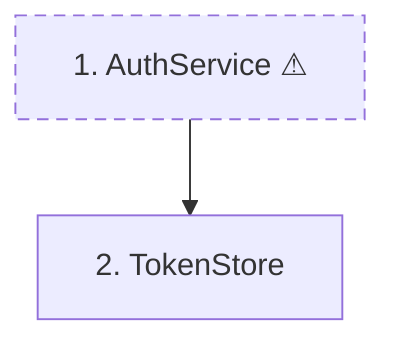
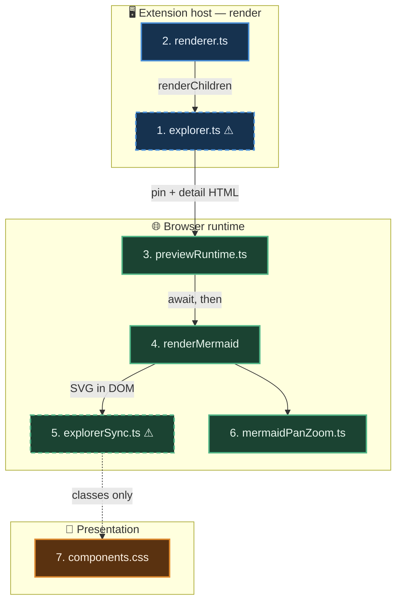

# `:::explorer` — design

**Date:** 2026-08-13 · **Status:** approved, not yet implemented
**Supersedes the renderer contract in** `.claude/session-notes/2026-08-13-explorer-directive.md`

:::info{title="What this builds" icon=map}
A container directive that renders a **master-detail view**: the mermaid diagram pins in place
while its per-node detail sections scroll beside it, with two-way selection sync. Click a box
to jump to its section; scroll the sections and the matching box highlights.
:::

## Why

A diagram is lossy. When detail sections sit *below* the diagram you scroll away from the
picture to read a box's meaning — so you lose track of which box you're reading, and you
can't tell when a box is hiding something.

That second half is the real requirement: **a reader must be able to tell, without clicking,
which boxes have more to read.** It drives the "linked node" affordance below, and it is why
"unmatched nodes are simply not clickable" was rejected — silence cannot communicate absence.

## Authoring contract

Fixed by `~/.claude/CLAUDE.md` §7, which mandates this format for every diagram Claude writes.
The live reference document is `~/.claude/diagrams/config-loading.md`.

````markdown
:::explorer


### 1. AuthService — `src/auth/service.ts:44`
Validates creds, issues JWT.

**Simplified:** one box, but refresh and revoke are separate flows.

### 2. TokenStore — `src/auth/store.ts:12`
Redis-backed. TTL is 15m, not configurable.

:::warning{title="Not shown" icon=visibility_off}
- Retry / backoff on token refresh
:::
:::
````

| Concern | Rule |
|---|---|
| Layout | First `mermaid` fence pins; **everything after it** scrolls in the detail pane |
| Matching | Mermaid node id `N<k>` ↔ heading whose text starts `<k>.` |
| Diagram types | `graph`/`flowchart`, `stateDiagram-v2`, `classDiagram` — others render pinned, unlinked |
| Click node | Scroll that section into view (`block: 'nearest'`), highlight node + section |
| Selection | Click-driven only, and **persists** until the next click — no scroll-spy |
| Linked node | Visibly marked, so an *unmarked* node reliably means "nothing more to read" |
| No match | Section renders normally, node stays unmarked — fail-soft |
| Attributes | `{pin=left}` (default), `{pin=top}`, `{width=45%}` |
| Wide screen | Diagram gets the full display height; block is at least one screen tall |
| Narrow screen | Stacks vertically, diagram sticky at top |
| Tall diagram | Stacked and over 60% of the viewport → doesn't pin at all |

## Architecture

:::explorer


### 1. explorer.ts — `src/core/directives/explorer.ts` (new, ~50 lines)

Container directive. Walks `node.children`, finds the first text node containing a
` ```mermaid ` fence, splits **that node's lines** at the fence's closing line.

- Pin pane = the fence lines.
- Detail pane = the remainder of that text node **plus every sibling child after it**.

That second clause is what keeps the nested `:::warning{title="Not shown"}` in the detail
column instead of dropping it — children are not a single text blob.

```html
<div class="em-explorer" data-pin="left" style="--em-explorer-width:45%">
  <div class="em-explorer__pin">…<div class="mermaid">…</div>…</div>
  <div class="em-explorer__detail">…headings, prose, nested directives…</div>
</div>
```

**Simplified:** drawn as one box, but it also has to preserve the `token.map`-derived
`data-line` wrapper that scroll sync depends on (`markdownItPlugin.ts`). Re-wrapping the
directive output is exactly what turns it into a scroll-sync dead zone.

No matching happens server-side. Both halves of the pairing already exist in the DOM, so
there is nothing to keep in sync across the boundary.

### 2. renderer.ts — `src/core/renderer.ts:85`

Unchanged. `ctx.renderChildren` is called per-slice by `explorer.ts` rather than once for the
whole node.

### 3. previewRuntime.ts — `src/core/previewRuntime.ts:276`

One line in `runShared`, but the **ordering is the point**:

```ts
if (mermaid) void renderMermaid(root, theme, mermaid).then(() => setupExplorers(root))
```

`renderMermaid` is async. Called unchained, `setupExplorers` runs before any SVG exists and
matches nothing.

### 4. renderMermaid — `src/core/previewRuntime.ts:88`

Unchanged. Its `theme+source → SVG` cache matters here: a cache hit restores byte-identical
SVG, so the per-render id prefix (see §5) stays stable across morphdom passes.

### 5. explorerSync.ts — `src/core/explorerSync.ts` (new, ~200 lines)

Per `.em-explorer`, pairs `:scope > :is(h1..h6)` headings whose text starts `<k>.` against the
diagram's nodes, marks the linked ones, and scrolls to a section when its node is clicked.

**Revised 2026-08-13: no scroll-spy.** The original two-way design was cut during
implementation. A pinned diagram already tells you where you are, and a spy fighting the
sticky pin made the highlight flicker as sections crossed the threshold. Selection is
click-driven and persists until the next click — including across morphdom re-renders, via a
module-level index→section map. The only listeners are `click` and `resize`.

`layout()` handles the two things CSS cannot decide alone, because both depend on the
diagram's *rendered* height:

- **Whether to pin at all.** A stacked diagram taller than 60% of the viewport would cover the
  text it points at, so it scrolls away normally instead.
- **How far to scroll past a heading.** `scrollIntoView` doesn't know a sticky element overlaps
  the target, so the pin's height becomes the heading's `scroll-margin-top`.

**Stacked-vs-side-by-side is detected horizontally** (`|pin.left − detail.left| < 1`). The
obvious vertical test — `pin.bottom <= detail.top` — reads "side by side" the moment the page
scrolls, because a sticky pin's vertical rect tracks the scroll position. That bug shipped into
the first build and was caught by sweeping viewport heights.

**Simplified:** the box hides the single most important implementation detail, verified
empirically on 2026-08-13 against mermaid 11.15 — see *Verified facts* below. Node ids carry a
**per-render prefix**, so the obvious selector silently matches nothing.

```ts
// ponytail: one regex pass over g.node beats a per-number selector and is
// immune to the mermaid-<timestamp>- id prefix changing between renders.
const RE = /(?:flowchart|state|classId)-N(\d+)-\d+$/
```

**Diagram-type coverage, probed 2026-08-13 against mermaid 11.15.** The three supported
types share one id shape and all render nodes as `g.node` with a usable bbox, so the badge,
flash and reveal code is type-agnostic and support costs exactly one alternation:

| Type | Node id | Author writes | Supported |
|---|---|---|---|
| `graph` / `flowchart` | `flowchart-N1-0` | `N1["1. Name"]` | yes |
| `stateDiagram-v2` | `state-N1-0` | `N1 : 1. Name` | yes |
| `classDiagram` | `classId-N1-0` | `class N1["1. Name"]` | yes |
| `erDiagram` | `entity-N1-0` | — | no: aliases are a parse error, so the box reads `N1` |
| `sequenceDiagram` | `actor0` | — | no: author id absent, positional only |
| `C4Context`, `timeline`, `journey`, `gitGraph`, mermaid `mindmap` | positional or none | — | no |

`erDiagram` is the notable exclusion: it *is* addressable, but with no alias support the
reader never sees the number the pairing is built on. Linking a box labelled `N1` is worse
than not linking it.

### 6. mermaidPanZoom.ts — `src/core/mermaidPanZoom.ts:170`

Unchanged, and **no conflict**: it bails on anything but button 2 (`e.button !== 2`), so pan is
right-drag only and left-click is entirely unclaimed. No click-vs-drag threshold needed.

Its expand button (`openModal`, `:225`) moves the live `<svg>` onto `document.body`. Sync
handlers are bound inside the explorer pane, so fullscreen is a pure "read it big" mode with
no sync — accepted, zero code.

### 7. components.css — `media/components.css` (new block, ~40 lines)

`.em-explorer` is a two-column grid; the pin column is `position: sticky; top: 0` with
`align-self: start`. No nested scroll container — the page scrolls. That keeps VS Code's
editor↔preview scroll sync alive inside the block and keeps `toc.ts`'s heading rects
unclipped. Sticky is viable in all three hosts: `.output-pane` is `overflow:auto`
(`base.css:127`), and `body`/document scrolls in the preview and the export.

`pin=top` and the narrow-screen stack are the same rule.

**Simplified:** one box, but three separate stacking and sizing problems live here.
The pin needs `z-index: 1` **and an opaque background** — inline `<code>` is
`position: relative`, and a positioned later sibling paints over a `z-index: auto` sticky
element, which put code spans on top of the diagram in stacked mode. Above 900px the pin is
`height: 100vh` and the block `min-height: 100vh`, so the diagram fills the screen and a short
detail column doesn't shrink it; the inner `.mermaid` needs `height: 100% !important` to beat
the inline height `enhanceMermaidZoom` sets. `.em-explorer--no-sticky` (added by `layout()`)
drops the pin back to `position: static`.
:::

## Verified facts

Probed on 2026-08-13 with mermaid 11.15 in headless Chromium, rendering a `graph TD` with two
subgraphs and nodes `N1`, `N2`, `N10`.

:::warning{title="Both of these would have shipped broken" icon=bug_report}
**Node ids carry a per-render prefix.** The real id is `mermaid-1786602232448-flowchart-N1-0`,
not `flowchart-N1-0`. `[id^="flowchart-N1-"]` returned **zero matches**. Match with
`/flowchart-N(\d+)-\d+$/` over `g.node`, or `[id*="flowchart-N1-"]`. The trailing dash keeps
`N1` from colliding with `N10` — confirmed against a real `N10` node.

**`classDef` writes `!important` inline.** The node's `<rect>` carries
`fill:… !important;stroke:… !important;stroke-width:2px !important`. Inline `!important` beats
stylesheet `!important`, so **no CSS can restyle a node's fill or border.** The affordance must
use properties `classDef` never touches.
:::

Cleared risks:

- **Subgraph membership does not change node ids.** `N1`/`N2` sit inside a `subgraph` and still
  render as `…-flowchart-N1-0`. Clusters get separate ids (`mermaid-…-boot`).
- **The `<g>` element has no inline style** (`null`), so `filter` and `cursor` on the `<g>` are free.

Consequent design:

| Affordance | Mechanism | Why not CSS on the shape |
|---|---|---|
| Linked (has detail) | `cursor:pointer` on `<g>` + appended SVG badge glyph | `fill`/`stroke` are locked by inline `!important` |
| Active (scrolled to) | `filter: drop-shadow(0 0 6px var(--c-primary))` on `<g>` | reads over any `classDef` fill, in every theme |

## Fail-soft

| Situation | Result |
|---|---|
| Plain markdown viewer, no renderer | `:::explorer` is literal text; content reads top-to-bottom |
| No mermaid fence in the block | Everything renders as detail |
| Unsupported diagram type (`sequenceDiagram`, `erDiagram`, …) | Pinned layout, zero matches, no linking |
| Node with no matching section | Renders, stays unmarked |
| Section with no matching node | Renders normally |

## Export

`explorerSync.ts` is imported by `previewRuntime.ts`, which both `preview.ts` and
`exportClient.ts` bundle. **No new dependency, no CDN script, no `.vscodeignore` change** —
unlike mindmap, this needs no heavy library injected as a parameter.

## Registration

- `src/core/directives/index.ts` — spread `explorerDirectives` in `buildRegistry()`
- `npm run build` — regenerates the TextMate grammar from the registry automatically
- `skills/blueprint-markdown/validate.mjs` — add `explorer` to `REGISTRY` as `container`
- `skills/blueprint-markdown/SKILL.md` — component catalog + silent-failure trap table

## Verification

:::warning{title="F5 is not proof" icon=warning}
Per `CLAUDE.md`: anything contributed through `package.json` reads from the source tree under
F5 but from the packaged bundle after install. This change touches the grammar (regenerated)
and `media/components.css`, so it must be exercised from a real `.vsix` install.
:::

:::steps
:::step{title="Drive every mouse button"}
Export via `blueprintMarkdown.exportHtml`, serve, drive with `playwright-cli`. The two mouse
components disagree on every button, so a screenshot proves nothing:

- **left-click a node** → detail scrolls, node highlights
- **left-drag** → text selection still works (this regressed once before, Jul 2026)
- **right-drag** → pan still works
- **double-right-click** → reset still works
- **scroll the detail pane** → active node tracks

Report which buttons were actually driven.
:::
:::step{title="Check a nested directive"}
Verify against a document with a directive inside a list/blockquote and an indented
`:::explorer` — one renderer change hits every directive at once.
:::
:::step{title="Confirm scroll sync survives"}
A nested/indented `:::explorer` must still carry `data-line`. Check the wrapper div, not just
that it renders.
:::
:::step{title="Package and install"}
`npm run package` → `code --install-extension` → reload → exercise in a normal window, not the
Extension Development Host.
:::
:::

## Not shown

:::warning{title="Not shown" icon=visibility_off}
- **Scroll-to-highlight** — cut during implementation, see §5. The reader learns where they
  are from the pinned diagram and the persistent click selection, not from a scroll spy
- **Highlight colors per theme** — uses `var(--c-primary)`; not yet checked against all
  `data-em-theme` values (neon, tropical-sorbet-night)
- **Keyboard navigation** — no focus/arrow-key story for the diagram nodes; mouse only
- **Multiple mermaid fences in one block** — only the first pins, the rest fall into the detail
  pane as ordinary diagrams. Deliberate, not implemented as an error
- **Deep-linking** — no URL fragment for "open explorer at node 5"
- **Failure paths** — what the sync does if `renderMermaid` rejects, or if the SVG is a mermaid
  parse-error placeholder
:::
