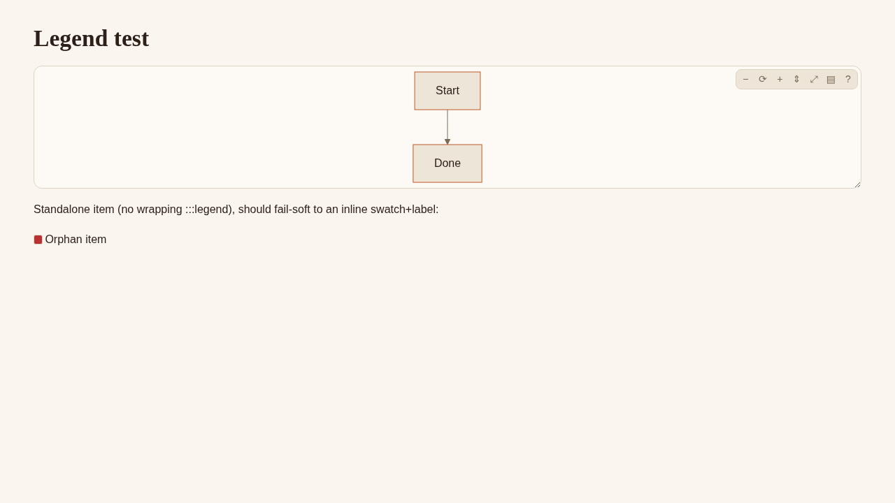
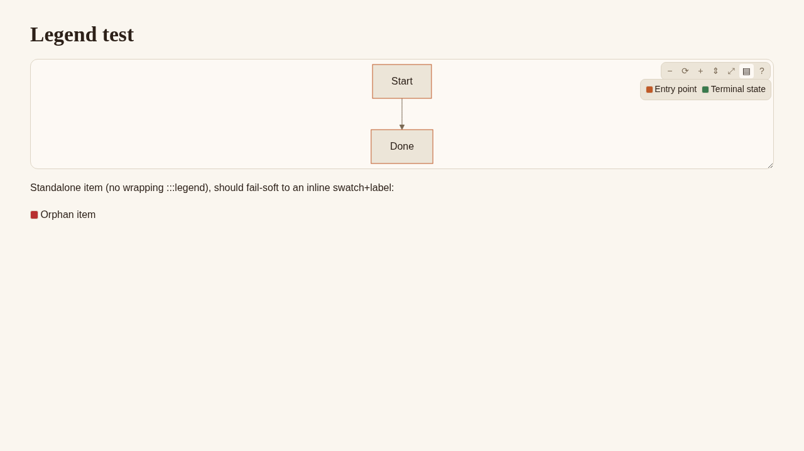
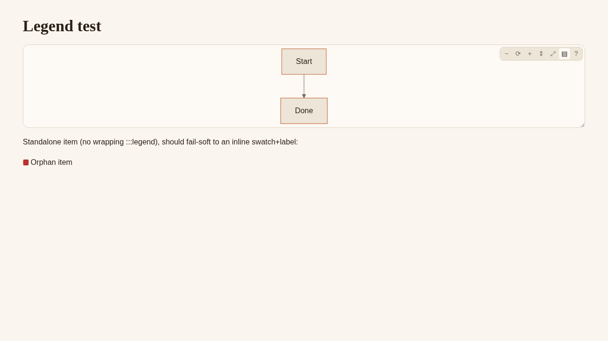
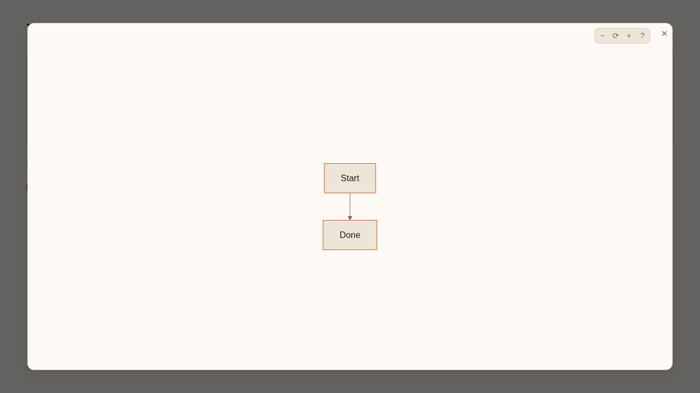
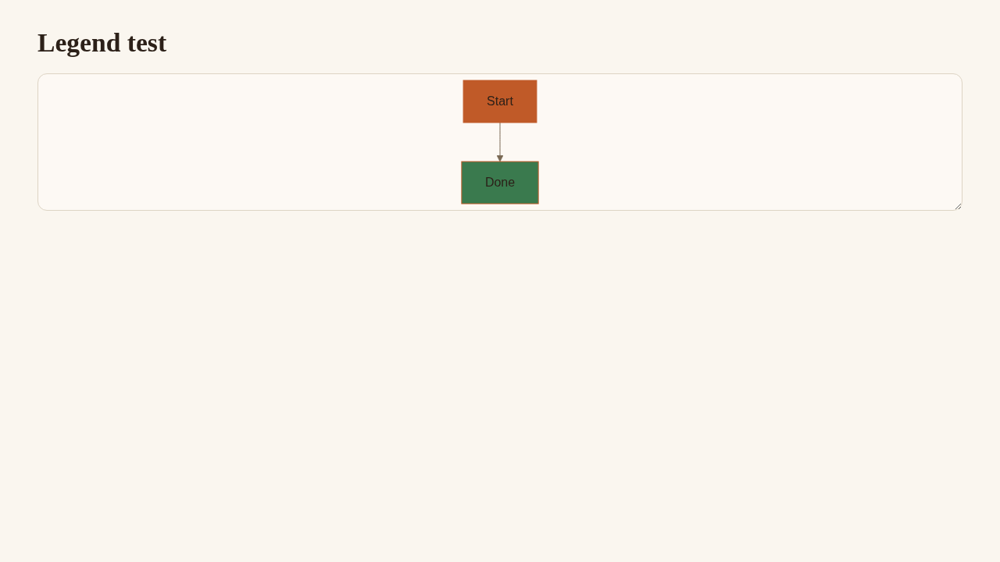
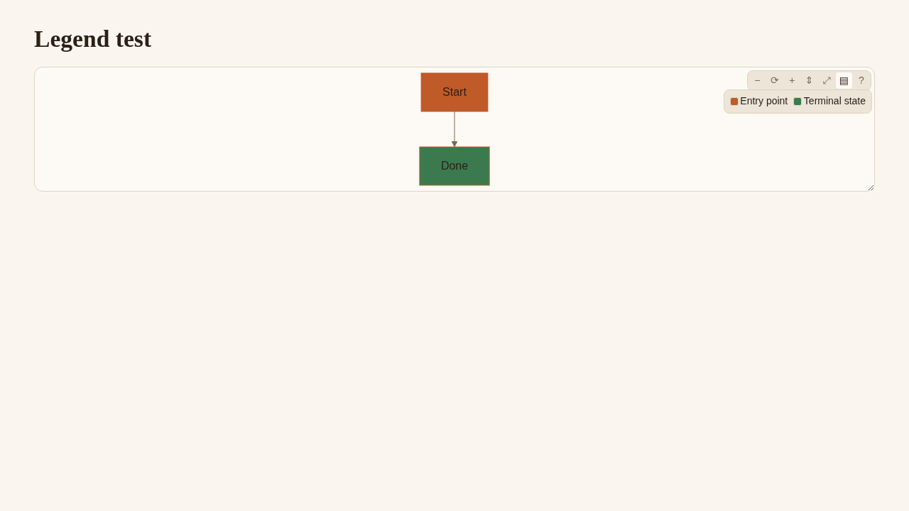

:::card{title="Evidence: mermaid legend directive (:::legend / ::legend-item)"}
::progress{value=11 max=11 color=success label="Cases passed"}
:::

| Case | Type | Verdict |
|------|------|---------|
| Build + grammar regeneration | CLI/build | :chip[PASS]{success} |
| Directive validator (silent-failure check) | CLI/build | :chip[PASS]{success} |
| Mermaid source integrity (`.mermaid` textContent unchanged) | CLI/build | :chip[PASS]{success} |
| Standalone `::legend-item` fail-soft render | UI | :chip[PASS]{success} |
| Legend button appears, opens panel with correct colors/labels | UI | :chip[PASS]{success} |
| Legend panel closes on second click | UI | :chip[PASS]{success} |
| Existing toolbar controls unaffected (zoom, reset, left/right-drag) | UI | :chip[PASS]{success} |
| Expand modal unaffected (opens/closes, no legend button there — by design) | UI | :chip[PASS]{success} |
| Grow button unaffected | UI | :chip[PASS]{success} |
| Fix: `classDef ... fill:var(--x)` now renders instead of erroring | UI | :chip[PASS]{success} |
| Fix: modal close no longer throws in `onRailEnter` | UI | :chip[PASS]{success} |

:::warning{title="Not covered"}
- Legend open/closed state surviving a live *document edit* (morphdom re-render) — requires the actual VS Code preview with live editing, which Playwright can't reach; this project's own convention is that only exported HTML is Playwright-reachable. Code path mirrors the already-working `panHandles` WeakMap pattern but wasn't live-driven.
:::

:::details{title="Case 1 — Build + grammar regeneration  :chip[PASS]{success}" open}
**What was checked:** `npm run build` succeeds and the auto-regenerated TextMate grammar picks up the new directive names.

```text title="npm run build"
> node esbuild.mjs
Wrote: media/fonts.css
Wrote: media/hljs.css
Wrote: media/em-theme.css
Wrote: syntaxes/blueprint.injection.tmLanguage.json
Wrote: dist/export-styles-*.css (9 themes)
Build complete.
```

```text title="grep legend syntaxes/blueprint.injection.tmLanguage.json"
"^\\s*(::)(progress|legend-item)(?:(\\{)...)?"
...revision|previous|explorer|legend)(?:(\\{)...)?"
```
:::

:::details{title="Case 2 — Directive validator  :chip[PASS]{success}" open}
**What was checked:** a test doc using `:::legend` + `::legend-item` (including one standalone, outside `:::legend`) passes the blueprint-markdown silent-failure validator.

```text title="node skills/blueprint-markdown/validate.mjs legend-test.md"
✓  legend-test.md: block directives OK
   Note: inline :name[text] directives are not checked here.
```
:::

:::details{title="Case 3 — Mermaid source integrity  :chip[PASS]{success}" open}
**What was checked:** `previewRuntime.ts` reads `.mermaid`'s own `textContent` as the diagram source — a `:::legend` wrapper must not add anything inside that div. Rendered the same diagram through the real parser/renderer (`src/core/parser.ts` + `src/core/renderer.ts` + the directive registry, no mocks) once wrapped in `:::legend` and once as a bare fence, and diffed the `.mermaid` div's contents.

```html title=".mermaid div, with :::legend"
<div class="mermaid">graph TD
  A[Start]:::primary --&gt; B[Done]:::success
  classDef primary fill:var(--c-primary),color:var(--text-base)
  classDef success fill:var(--c-success),color:var(--text-base)</div>
```

```html title=".mermaid div, bare fence (no :::legend)"
<div class="mermaid">graph TD
  A[Start]:::primary --&gt; B[Done]:::success
  classDef primary fill:var(--c-primary),color:var(--text-base)
  classDef success fill:var(--c-success),color:var(--text-base)</div>
```

Byte-identical. The legend panel (`<div class="em-mermaid__legend">`) is emitted as a sibling under a `.em-legend-wrap` div, never a child of `.mermaid`.
:::

:::details{title="Case 4 — Standalone ::legend-item fail-soft render  :chip[PASS]{success}" open}
**What was checked:** `::legend-item{color=danger label="Orphan item"}` used outside any `:::legend` renders as a plain inline swatch + label instead of erroring or vanishing.


:::

:::details{title="Case 5 — Legend button opens the panel  :chip[PASS]{success}" open}
**What was checked:** clicking the new toolbar button (▤) shows the legend panel with the swatch colors and labels declared in the `::legend-item` children.


:::

:::details{title="Case 6 — Legend button closes the panel  :chip[PASS]{success}" open}
**What was checked:** clicking the same button again hides the panel.


:::

:::details{title="Case 7 — Existing toolbar controls unaffected  :chip[PASS]{success}" open}
**What was checked:** driving every other button/gesture on the toolbar after adding the legend button, per this repo's own rule that a mouse-handler change must exercise every button, not just the one named in the request.

| Action | Result |
|--------|--------|
| Zoom in | `transform: translate(519.594px, -21.75px) scale(1.25)` |
| Zoom out | `transform: translate(533.875px, 0px) scale(1)` |
| Reset | `transform: translate(533.875px, 0px) scale(1)` |
| Left-drag | transform unchanged (selection left alone, as intended) |
| Right-drag | `translate(593.875px, 38px)` — moved by exactly the mouse delta |
| Double right-click | reset back to `translate(533.875px, 0px) scale(1)` |

:::

:::details{title="Case 8 — Expand modal unaffected  :chip[PASS]{success}" open}
**What was checked:** the fullscreen expand modal still opens and closes correctly; it has no legend button (skipped for v1, by design).



**Notes:** modal close triggers a pre-existing, unrelated console error (`TypeError` in `onRailEnter`, `src/core/toc.ts:89`) — reproduced identically on a plain mermaid diagram with no `:::legend` involved, confirming it predates this change.
:::

:::details{title="Case 9 — Grow button unaffected  :chip[PASS]{success}" open}
**What was checked:** the panel-resize "grow" button still works.

```text
document.querySelector('.mermaid').style.height → "672px" (viewport-height based, as expected)
```
:::

:::details{title="Case 10 — Fix: classDef var() colors now render  :chip[PASS]{success}" open}
**What was checked:** `classDef ... fill:var(--c-primary)` previously rendered mermaid's own error SVG (mermaid's grammar rejects parentheses in a style value at all, confirmed even with `securityLevel:'loose'` — not a sanitization setting). Fixed in `src/core/previewRuntime.ts` (`resolveCssVars`): the diagram source is now scanned for `var(--x)` and substituted with the CSS custom property's own computed value (reusing the same `getComputedStyle` lookup `renderMermaid` already does for `themeVariables`) before mermaid ever sees it. This keeps the documented `var(--c-primary)` authoring syntax working — including on `:::legend`'s own paired diagram — without asking authors to hardcode theme-specific hex.

Same diagram from `skills/blueprint-markdown/references/syntax.md`'s own documented example (`classDef alert fill:var(--c-danger-bg),...`), now rendering instead of erroring, with the legend swatches matching the actual node colors:





**Notes:** no `var(--x, fallback)` second-argument support — nothing in this repo writes one; add if that syntax shows up in a diagram.
:::

:::details{title="Case 11 — Fix: onRailEnter no longer throws on modal close  :chip[PASS]{success}" open}
**What was checked:** closing the mermaid expand-modal removes the element under the cursor, which fires a `mouseenter` whose `e.target` can be a non-`Element` (e.g. `Document`) with no `classList` — `target?.classList.contains(...)` only guards the `target` step, not the `.classList` step, so it threw. Fixed in `src/core/toc.ts` (`onRailEnter`) by adding a second `?.`: `target?.classList?.contains('em-toc')`.

```text title="Console after modal close, before vs. after the fix"
Before: TypeError: Cannot read properties of undefined (reading 'contains')
        at HTMLDocument.onRailEnter (...)
After:  (no console errors)
```
:::
