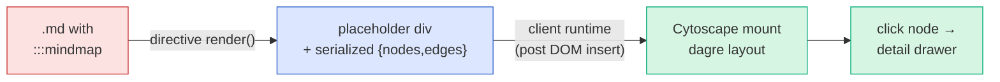

# Mindmap Markdown — Design

A `:::mindmap` directive that turns heading-structured markdown into an interactive
node-graph. Built as a standalone previewer first, then merged into the
`blueprint-markdown` VS Code extension as one more directive.

**Goal:** let an AI emit an answer that a human reads *faster* by seeing structure and
relationships as a graph — while the raw `.md` stays plain, legible, and cheap for the AI
to produce reliably.

---

## 1. Design decisions (locked)

| Decision | Choice | Why |
|---|---|---|
| Shape of content | **Tree-first**, with occasional cross-links | Real AI output is ~90% hierarchy; a full graph model is overkill and hard to author. |
| Authoring surface | **Markdown headings** inside `:::mindmap` | The AI writes normal markdown — the thing it does best. No per-node IDs or edge bookkeeping in the common case. |
| Internal model | **`{nodes, edges}` JSON** | What the graph renderer consumes. The parser produces it; the AI never writes it. |
| Layout | **Layered DAG** (dagre), left-to-right | Handles arbitrary depth *and* cross-links with clean edges. Avoids the "ball of yarn" / perimeter-routing problems of a fixed concentric layout. |
| Renderer | **Cytoscape.js + dagre** | Built-in layouts, styling, and neighborhood-highlight APIs. Mirrors how mermaid is bundled in the extension today. |
| Node typing | **Inferred from heading depth**, overridable | Zero syntax in the common case; maps cleanly to the Context / Solution / Detail tiers. |

### Non-goals (for now)

- Free-form drag-to-connect editing. Authoring is text; the graph is a read view.
- A general many-to-many graph authoring language. Cross-links are the escape hatch, not the primary model.
- Custom concentric/radial geometry. Deferred; may return as a layout option.

---

## 2. Authoring format

The `.md` region is ordinary markdown. **Heading level = tree depth. The content under a
heading = that node's body** (rendered in the detail drawer on click).

```
:::mindmap

# Database latency > 2s
Dashboards spin on every load. p95 is 2.4s.

## Add Redis cache {#redis}
Cache hot queries; TTL 60s.
```js
client.setex(key, 60, val)
```

### Warm cache on deploy
- [ ] Prefetch top 100 queries
- [ ] Alert if hit-rate < 80%

## Add CDN
Offload static assets. Shares invalidation logic with [[redis]].

:::
```

### What each piece maps to

| Concern | Mechanism | AI effort |
|---|---|---|
| Hierarchy (the 90%) | heading level: `#` → `##` → `###` | none — plain markdown |
| Node label | the heading text | none |
| Node body (drawer content) | everything under the heading, up to the next heading of equal/higher level | none |
| Node type / color | inferred from depth (see below), override with `{#id type=...}` | none by default |
| Node id | `{#id}` on the heading, else slugified heading text | tiny, only when linked to |
| Cross-link (the 10%) | `[[id]]` anywhere in a body → dashed edge to that node | tiny, only when needed |

### Type-by-depth (default)

| Depth | Type | Meaning | Default color token |
|---|---|---|---|
| `#` (h1) | `context` | The "why" — problem, requirement, goal | `danger` (coral/red) |
| `##` (h2) | `solution` | The "what" — approach, feature, strategy | `info` (blue) |
| `###`+ (h3+) | `detail` | The "how" — tasks, specs, metrics | `success` (green) |

Override per node when depth doesn't match intent: `## Quick note {type=detail}`.
Colors use the existing blueprint color tokens so themes apply automatically.

### Structural rules

- **One `#` = one root.** Multiple `#` headings become children of an implicit root node.
- **Parent** = the nearest preceding heading of a lower level.
- **Skipped levels are tolerated** (`#` then `###`): the `###` attaches to the nearest shallower heading.
- **`[[id]]`** referencing an unknown id renders as plain text (fail-soft), not an error.

---

## 3. Data model (internal)

The parser emits this; the renderer consumes it. Unchanged in spirit from the original idea.

```json
{
  "nodes": [
    { "id": "database-latency-2s", "type": "context",  "label": "Database latency > 2s", "body": "Dashboards spin..." },
    { "id": "redis",              "type": "solution", "label": "Add Redis cache",     "body": "Cache hot queries..." },
    { "id": "warm-cache",         "type": "detail",   "label": "Warm cache on deploy","body": "- [ ] Prefetch..." }
  ],
  "edges": [
    { "source": "database-latency-2s", "target": "redis",      "kind": "tree" },
    { "source": "redis",               "target": "warm-cache", "kind": "tree" },
    { "source": "add-cdn",             "target": "redis",      "kind": "link" }
  ]
}
```

- `body` holds the raw markdown under the heading; the drawer renders it on demand.
- `kind: "tree"` edges follow heading structure (solid). `kind: "link"` edges come from `[[id]]` (dashed).

---

## 4. Pipeline



**Parse step (inside `render()`):**

1. Take the raw body lines of the `:::mindmap` block.
2. Split into nodes at heading boundaries; track a level stack to assign parents.
3. Resolve ids (`{#id}` or slug), infer types from depth, scan bodies for `[[id]]`.
4. Emit `{nodes, edges}` and serialize into the placeholder's `data-graph` attribute.
5. Do **not** render the graph server-side — emit an empty sized container for the client to mount into.

**Mount step (client runtime):** find every `.em-mindmap` placeholder, parse `data-graph`,
build a Cytoscape instance with dagre layout, wire click → drawer.

---

## 5. Rendering & interaction

### Layout & style

- **dagre**, direction `LR` (left → right). Depth increases rightward.
- Node = rounded rect, colored by type token, label = heading text (truncated to ~6 words on the node face).
- Tree edges solid; cross-link edges dashed.

### MVP interactions

- **Click node → detail drawer.** A slide-out panel renders the node's full markdown body
  (code, checklists, images) via markdown-it. Clicking the background closes it.
- Pan / zoom / fit-to-view.

### Deferred to v2 (explicitly not MVP)

- **Path isolation on hover** — fade unrelated nodes to ~10%, highlight upstream/downstream.
- Animated / directional edges.
- Focus-lock (auto-center on selected node while drawer is open).
- Alternative concentric layout option.
- Collapse/expand subtrees.

---

## 6. How it merges into `blueprint-markdown`

The extension already has the exact pattern we need: **mermaid**. A fence emits
`<div class="mermaid">`, and a bundled client runtime renders it after DOM insert.
Cytoscape follows the same path.

| Concern | Existing analog | Mindmap approach |
|---|---|---|
| Register directive | `src/core/directives/*.ts` + `directives/index.ts` | Add `directives/mindmap.ts` exporting a `DirectiveSpec`. Grammar/parser untouched. |
| Server render | `fence.ts` emits `<div class="mermaid">` | `render()` emits `<div class="em-mindmap" data-graph="…">` (empty, sized). |
| Client hydrate | `previewRuntime.ts` runs mermaid on `.mermaid` | New runtime mounts Cytoscape on `.em-mindmap`. |
| Heavy lib in preview | mermaid **bundled** into `dist/preview.js` (nonce-only CSP blocks CDN) | Bundle `cytoscape` + `cytoscape-dagre` into `preview.js`. |
| Heavy lib in export | mermaid loaded from **CDN** in `exportClient.ts` | Load cytoscape from CDN in the export path. |
| Survives edits | mermaid caches rendered SVG; state in module maps (morphdom re-renders on keystroke) | Cache the mounted instance keyed by graph-content hash; keep pan/zoom/selection in module-level state. |
| Theming | `body[data-em-theme]` + CSS custom properties | Read color tokens from computed CSS vars so all themes apply. |

> **Morphdom caveat:** the preview re-patches the DOM on every keystroke. The runtime must
> not rebuild the graph from scratch each time — detect unchanged `data-graph` and re-attach
> the cached instance, exactly as the mermaid runtime restores cached SVG.

### Standalone-first build

Build a self-contained `viewer.html` (drag a `.md` onto it) using `markdown-it` +
`markdown-it-container` + `cytoscape` + `cytoscape-dagre`. Keep the parser and the mount
runtime as separate modules so they lift into `src/core/` unchanged at merge time.

---

## 7. Dependencies

| Package | Role |
|---|---|
| `markdown-it` | Parse the doc / render node bodies (already in the extension) |
| `markdown-it-container` | `:::` block handling in the standalone build |
| `cytoscape` | Graph rendering + interaction |
| `cytoscape-dagre` (+ `dagre`) | Layered DAG layout |

---

## 8. MVP scope & verification

```
1. :::mindmap directive + heading-tree parser → {nodes, edges}
   verify: console output matches the §3 schema for the §2 sample

2. Cytoscape mount, dagre LR layout, color by type
   verify: sample.md renders as a left-to-right tree, colors per §2 table

3. Cross-link [[id]] → dashed edge
   verify: the "Add CDN → redis" dashed edge appears

4. Click node → drawer renders that node's markdown body
   verify: clicking "Warm cache on deploy" shows the checklist and code
```

Ship these four. Everything in §5 "Deferred" is v2.

---

## 9. Open questions

- **Empty-body nodes:** heading with no content under it — drawer shows just the title, or suppress the click? (Lean: show title only.)
- **Very deep trees:** dagre `LR` can get wide. Do we cap default depth shown and lazy-expand? (Defer; revisit if real docs get unwieldy.)
- **Multiple roots:** implicit virtual root vs. a forest of separate graphs. (Lean: single virtual root for MVP.)
