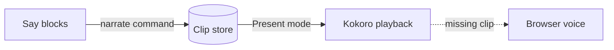

# Kokoro makes Present mode sound human

## The browser voice was the weak link :cue{#hook}

:::warning{title="The old voice" #old}
In the VS Code preview, the browser voice is robotic — or missing entirely on Linux.
:::

## The answer: pre-generated neural audio :cue{#answer}

One command turns every narrated sentence into a Kokoro recording. Present mode plays it.

## Three parts, joined by one clip store :cue{#parts}



:::steps{#flow}
:::step{title="Write" #write}
`:::say` blocks in the markdown file.
:::
:::step{title="Generate" #gen}
`npm run narrate -- talk.md` writes one WAV per sentence to `.narration/talk/`.
:::
:::step{title="Present" #show}
Pick **Kokoro** in the voice menu. Missing sentences fall back to the browser voice.
:::
:::

## Only changed sentences regenerate :cue{#reuse}

```diff #naming title="speech.ts"
- return `.narration/${doc}/${voice}-${index}.wav`
+ return `.narration/${doc}/${voice}-${hash53(sentence)}.wav`
```

| Measured on a 16-core laptop | Result :cue{#speed table} |
|---|---|
| Model load :cue{#load} | 12 seconds, once per run |
| Generation | 0.6 × real time |
| Re-run with no edits :cue{#rerun} | 0 sentences generated |

## Risks and open questions :cue{#risks}

:::info{title="Not yet proven" #gap}
Playback was tested in a browser page running the same code, not yet inside the VS Code preview.
Word highlighting is estimated, because the audio carries no word timings.
:::

## Next step :cue{#next}

Open a presentation in the VS Code preview and confirm the Kokoro voice plays.

:::narration
:::say{on="hook old" note="Browser voices are the weak link"}
Present mode reads a document out loud. Until now, the voice was the weak link. In the VS Code preview, it sounds robotic. On Linux, there is often no voice at all.
:::
:::say{on="answer" note="One command, natural voice"}
Here is the short version. One command now records every sentence with Kokoro, a small neural voice. Present mode plays those recordings instead.
:::
:::say{on="map" note="The clip store sits in the middle"}
:at{#script} It starts with the say blocks. :at{#store} They feed the clip store. :at{#kokoro} And the store feeds Kokoro playback. :at{#browser} If a clip is missing, playback falls back to the browser voice.
:::
:::say{on="flow" note="Write, generate, present"}
:at{#write} Those parts map to three steps. First, write the narration in the markdown file. :at{#gen} Second, run the narrate command. :at{#show} Third, choose Kokoro in the voice menu, and press play.
:::
:::say{on="naming" note="File name comes from the sentence"}
:at{lines="1"} Before, a recording was named by its position. Insert one sentence, and every recording after it was stale. :at{lines="2"} Now the name comes from the sentence itself. So only a changed sentence is recorded again.
:::
:::say{on="speed" note="Faster than real time"}
:at{#load} It is also fast enough. After a short model load, it records faster than real time. :at{#rerun} A second run, with no edits, records nothing at all.
:::
:::say{on="gap" note="⚠ Not tested in VS Code yet"}
Two things are not proven yet. Playback was tested in a browser, not inside VS Code itself. And the highlighted word is an estimate, so it can drift from the voice.
:::
:::say{on="next" note="Confirm in the real preview"}
So the next step is simple. Open a presentation in the VS Code preview, and confirm that Kokoro is the voice you hear.
:::
:::
