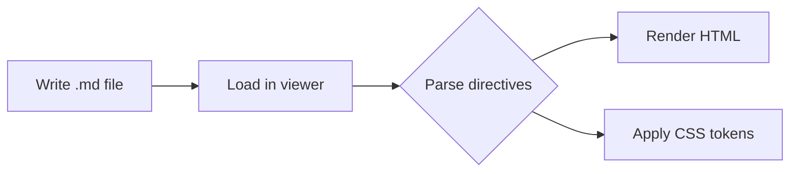

# Blueprint Markdown — Syntax Reference

> This file is the conformance fixture for the blueprint-markdown renderer.
> Every feature is exercised here in one readable document.

---

## Standard Markdown

Paragraphs, **bold**, *italic*, ~~strikethrough~~, `inline code`, and ==highlighted== text all work as normal.

[Links work normally](https://example.com), and so do images.

### Task list

- [x] Design the syntax spec
- [ ] Build the renderer
- [ ] Write user-facing documentation

### Table

| Attribute | Type                           | Default |
|-----------|--------------------------------|---------|
| `color`   | token or hex `#0a7`            | —       |
| `variant` | `outline` \| `soft` \| `solid` | `soft`  |
| `size`    | `sm` \| `md` \| `lg`          | `md`    |

---

## Code Blocks

### Line highlighting

```js {1,3-5} title="app.js"
import { md } from './renderer'

const html = md.render(source)
document.getElementById('app').innerHTML = html
document.title = 'Blueprint Markdown'
var a = () => { () => {} }
```

### Mermaid diagram


---

## Cards

### Single card

:::card{title="Zero boilerplate" icon=auto_awesome}
Write clean markdown. The renderer handles the HTML, CSS, and JavaScript —
including interactive components like tabs, accordions, and tooltips.
:::

### Card grid

:::cards{cols=3}
:::card{title="Fast" icon=bolt}
Parses in under 5 ms for typical documents.
:::
:::card{title="Themeable" icon=palette}
Light and dark modes driven by a single set of CSS variables.
:::
:::card{title="Extensible" icon=extension}
Add a new directive with one registry entry and matching CSS.
:::
:::

---

## Callouts

:::note
Callouts render inline with the document flow. No HTML needed.
:::

:::tip{title="Pro tip"}
Nest **markdown** inside any directive — bold, links, and code all work.
:::

:::warning{title="Mind the nesting"}
Keep directive nesting shallow. More than two levels deep usually signals the
content itself needs restructuring.
:::

:::danger
Unclosed `:::` blocks will consume the rest of the document. Always close your directives.
:::

:::success{title="Done"}
The document rendered correctly and all tests passed.
:::

:::callout{type=info title="Custom type" icon=info}
Use `:::callout{type=... title=... icon=...}` when the built-in named types don't fit.
:::

---

## Collapse / Accordion

:::details{title="How does line highlighting work?"}
Add a meta string after the language name: ` ```js {1,3-5} title="file.js" `.

The renderer applies `.line-highlight` as a CSS class to the listed line indices.
:::

:::details{title="Starts expanded" open}
Add `{open}` to the attribute block to expand the section by default.
:::

:::accordion
:::details{title="What parsers does this use?"}
A **custom recursion-based block parser** handles `:::` containers and `::` leaf blocks.
`markdown-it` handles all GFM / CommonMark content, extended with `markdown-it-mark`
(`==highlight==`) and `markdown-it-task-lists`. Note: `markdown-it-directive` and
`markdown-it-attrs` are **not** used — nesting uses repeated `:::`, not increasing colon
counts.
:::
:::details{title="Does it work offline?"}
Yes — all assets are bundled into a single HTML file. No network requests at runtime.
:::
:::details{title="Can I add my own directives?"}
Yes. Register a handler in the directive registry. The grammar never changes;
only your renderer function does.
:::
:::

---

## Columns

:::columns{count=2 gap=lg}
:::col
### Left column
Text in the left column. Markdown works here: **bold**, *italic*, `code`.

- item one
- item two
:::
:::col
### Right column
Columns snap to a single column below the `md` breakpoint (768 px by default).

Use `:::col{span=2}` to make a column span more of the grid.
:::
:::

:::columns{count=3}
:::col
**One** — equal thirds.
:::
:::col
**Two** — `gap` defaults to `md`.
:::
:::col
**Three** — add `gap=sm|md|lg` to override.
:::
:::

---

## Timeline

:::timeline
:::event{date="Day 1" icon=edit_note}
**Define the syntax** — choose the directive grammar and feature catalog.
:::
:::event{date="Day 2" icon=code color=primary}
**Build the renderer** — wire up markdown-it with plugins and custom fence handlers.
:::
:::event{date="Day 3" icon=palette color=success}
**Style the components** — write the CSS token system and light/dark themes.
:::
:::event{date="Day 4" icon=rocket_launch color=warning}
**Ship** — bundle into a single self-contained HTML file.
:::
:::

---

## Tabs

:::tabs
:::tab{title="npm"}
```sh
npm install blueprint-markdown
```
:::
:::tab{title="pnpm"}
```sh
pnpm add blueprint-markdown
```
:::
:::tab{title="yarn"}
```sh
yarn add blueprint-markdown
```
:::
:::

---

## Steps

:::steps
:::step{title="Install"}
Add the package to your project.

```sh
npm install blueprint-markdown
```
:::
:::step{title="Create a markdown file"}
Write your `.md` file using any of the directives in this reference.
The syntax is clean enough to read as plain text before rendering.
:::
:::step{title="Open in the viewer"}
Drag the file onto `viewer.html`, or serve it with any static file server.
The renderer runs entirely in the browser — no build step required.
:::
:::

---

## Inline elements

### Chips

Status: :chip[Active]{success} :chip[Beta]{color=warning variant=outline} :chip[Minor]{low} :chip[v2.1]{color=primary} :chip[Deprecated]{danger}

### Icons

Click :icon[home] to go home, or :icon[settings]{size=18} to open settings.
Use :icon[rocket_launch]{fill color=primary} for filled icons.

### Colored text

:color[This is critical.]{danger}
:color[This is blue.]{color=primary}
Regular text is unaffected.

### Keyboard shortcuts

Press :kbd[Ctrl+K] to open the command palette, or :kbd[Esc] to dismiss.
Save with :kbd[Ctrl+S] on Windows or :kbd[⌘+S] on Mac.

### Buttons

:button[Read the docs]{href="#" color=primary variant=solid}
:button[View source]{href="#" variant=outline}

### Tooltip

Hover over :tooltip[this word]{tip="This is the tooltip content."} to see the tooltip.
Tooltips support any inline :tooltip[markdown]{tip="**Bold** and `code` work here."}.

### Rating

Quality: :rating{value=4 max=5}

---

## Progress (leaf block)

::progress{value=65 max=100 color=primary label="Parser coverage"}
::progress{value=100 max=100 color=success label="Syntax spec"}
::progress{value=20 max=100 color=warning label="Test suite"}

---

## Mark / Highlight

Use ==double equals== to highlight a span of text inline.

Combined with color: this is ==very important== and :color[this is critical]{danger}.
