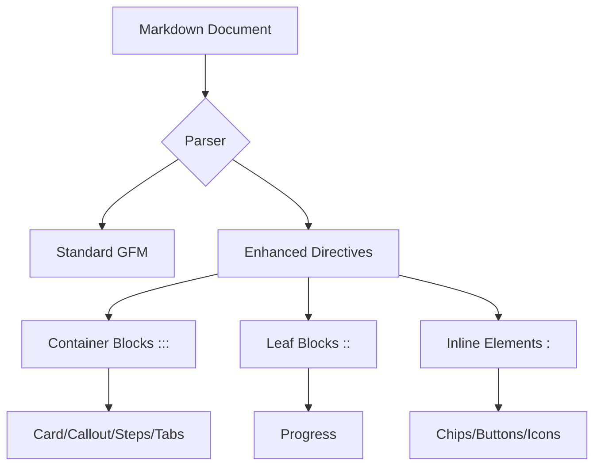

:::card{title="Enhanced Markdown Test Suite" icon=rocket}
This document is designed to verify the rendering of different component types, from containers to inline elements.
:::

## 📊 Progress & Status
::progress{value=85 max=100 color=primary label="Component Coverage"}

Status: :chip[Ready]{success} :chip[Testing]{warning} :chip[v1.0]{low}

---

## 🛠️ Layouts and Containers

:::columns{count=2 gap=md}
:::col
### 💡 Pro Tip
Use `:chip` for status indicators to keep your text clean and scanable.
:::

:::col
### ⚠️ Warning
Always remember to close your `:::` blocks, or the rest of the document will disappear!
:::
:::

:::accordion
:::details{title="Technical Specifications" open}
The grammar uses three distinct colon counts:
- `:` for inline elements.
- `::` for the `progress` leaf block.
- `:::` for container blocks.
:::

:::details{title="Compatibility Note"}
These directives are intended for the **enhanced-markdown viewer**. In standard GitHub or Slack environments, they will render as plain text.
:::
:::

---

## 📐 Architecture Overview



---

## 🚀 Process & Workflow

:::steps
:::step{title="Design"}
Define the structure using standard Markdown first.
:::
:::step{title="Enrich"}
Apply `enhanced-markdown` directives to add visual depth.
:::
:::step{title="Verify"}
Check the raw source to ensure no "silent failure" traps were triggered.
:::
:::

:::tabs
:::tab{title="Command Line"}
```bash
# Using the CLI
claude /enhanced-markdown "your content"
```
:::
:::tab{title="Manual Authoring"}
```markdown
:::card{title="Manual"}
Content here.
:::
```
:::

---

## 📝 Quick Reference Table

| Feature | Syntax Example | Type |
| :--- | :--- | :--- |
| **Callout** | `:::callout{type=info}` | Container |
| **Button** | `:button[Click Me]{color=primary}` | Inline |
| **Progress** | `::progress{value=50}` | Leaf |
| **Highlight** | `==important text==` | GFM |

:::callout{type=success title="Test Passed" icon=check_circle}
If you can see this colored box, the container system is working perfectly!
:::
